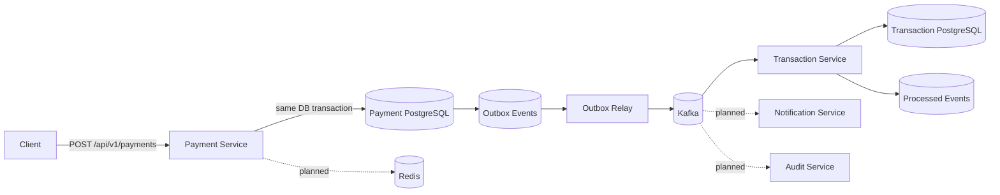

# Event-Driven Payment Platform

A portfolio-grade payment processing backend focused on the engineering concerns that matter in real distributed systems: **idempotent APIs, durable persistence, event-driven workflows, failure isolation, observability, and clear service boundaries**.

> Status: Phase 3 — Payment command service, transactional outbox, and idempotent transaction consumer are implemented. Retry/DLQ, auth, observability, and deployment modules are next.

## Why this project exists

Payment APIs look simple until retries, duplicate requests, partial failures, asynchronous processing, and audit requirements are introduced. This project demonstrates how to design those concerns deliberately instead of hiding them behind a CRUD demo.

## Architecture



## Implemented

- Java 17 + Spring Boot services
- Versioned payment REST API
- `Idempotency-Key` support backed by a database uniqueness guarantee
- PostgreSQL persistence with Flyway migrations
- Transactional outbox written in the same database transaction as the payment
- Scheduled outbox relay publishing `payments.created.v1` events to Kafka
- At-least-once event delivery semantics
- Separate Transaction Service with its own PostgreSQL datastore
- Idempotent Kafka consumer using durable `processed_events` records
- Kafka acknowledgement only after the local transaction completes
- Payment-level uniqueness guard to prevent duplicate transaction rows
- Spring Boot Actuator health/metrics endpoints
- Unit tests covering API idempotency and duplicate event consumption
- Docker Compose for both PostgreSQL datastores, Redis, and Kafka
- GitHub Actions Maven CI

## Reliability flow

```text
HTTP payment request
        ↓
Payment Service
        ↓
BEGIN DB TRANSACTION
  ├── INSERT payment
  └── INSERT outbox event
COMMIT
        ↓
Outbox Relay
        ↓
Kafka: payments.created.v1
        ↓
Transaction Service
        ↓
BEGIN DB TRANSACTION
  ├── check processed_events(event_id)
  ├── INSERT payment_transaction
  └── INSERT processed_event
COMMIT
        ↓
acknowledge Kafka offset
```

This design intentionally supports **at-least-once delivery**. If the consumer commits its database transaction but crashes before acknowledging Kafka, the event may be delivered again. The `processed_events` table makes that redelivery safe.

## API

### Create a payment

```bash
curl -X POST http://localhost:8080/api/v1/payments \
  -H 'Content-Type: application/json' \
  -H 'Idempotency-Key: checkout-7f41d' \
  -d '{
    "amount": 42.50,
    "currency": "USD",
    "customerId": "customer-123"
  }'
```

Repeating the request with the same `Idempotency-Key` returns the already-created payment instead of creating a duplicate.

### Retrieve a payment

```bash
curl http://localhost:8080/api/v1/payments/{paymentId}
```

## Run locally

Prerequisites: Java 17+, Maven, Docker.

```bash
docker compose up -d
mvn spring-boot:run -pl payment-service
mvn spring-boot:run -pl transaction-service
```

Payment Service health:

```bash
curl http://localhost:8080/actuator/health
```

Transaction Service health:

```bash
curl http://localhost:8081/actuator/health
```

## Engineering decisions

### Request idempotency

Client retries are normal in payment systems. The Payment Service accepts an `Idempotency-Key`, persists it with a unique database constraint, and reuses the original payment for repeated requests. A later phase will add Redis as a fast-path while PostgreSQL remains the durability boundary.

### Transactional outbox

A direct `save payment -> publish Kafka` flow creates a dual-write problem: the database commit may succeed while Kafka publication fails. The payment would then exist without the corresponding domain event.

The current flow persists both the payment and its outbox record inside the same database transaction. If Kafka is unavailable, the outbox event stays `PENDING` and the relay can publish it later.

### Idempotent consumer

The Transaction Service stores processed Kafka event IDs in its own PostgreSQL database. The transaction row and the processed-event marker are committed together. Kafka is acknowledged only after processing completes.

This means a crash between database commit and Kafka acknowledgement may cause redelivery, but the same event cannot reproduce the business side effect.

The service also enforces uniqueness on `payment_id` and `source_event_id`, providing a second database-level guard against duplicate writes.

### Service data ownership

Payment and transaction records live in separate PostgreSQL databases. This keeps the services from reading or mutating each other's tables directly and makes Kafka the integration boundary between them.

### Current relay trade-off

The outbox relay polls small batches from PostgreSQL and publishes them synchronously before marking each event complete. This keeps the failure model easy to inspect. A later scale-oriented iteration can add row claiming / `SKIP LOCKED`, backoff, terminal failure states, and concurrent relay workers.

## Roadmap

- [x] Payment command API
- [x] PostgreSQL + Flyway
- [x] Transactional outbox pattern
- [x] Kafka outbox relay
- [x] Idempotent Transaction Service Kafka consumer
- [x] Separate service-owned transaction datastore
- [x] Base CI pipeline
- [ ] Retry topics + dead-letter queue
- [ ] Notification service
- [ ] Audit service
- [ ] Redis idempotency fast-path
- [ ] OAuth2/JWT authentication
- [ ] OpenAPI documentation
- [ ] Testcontainers integration tests
- [ ] OpenTelemetry + Prometheus/Grafana
- [ ] Multi-instance outbox claiming with `SKIP LOCKED`
- [ ] Kubernetes manifests / Helm
- [ ] AWS deployment architecture

## Tech stack

**Backend:** Java 17, Spring Boot, Spring Data JPA, Spring Kafka  
**Data:** PostgreSQL, Redis  
**Messaging:** Apache Kafka  
**Infrastructure:** Docker Compose, GitHub Actions  
**Observability:** Spring Boot Actuator (OpenTelemetry/Prometheus planned)

## Repository structure

```text
event-driven-payment-platform/
├── payment-service/
│   ├── src/main/java/com/charitha/payments/
│   ├── src/main/resources/db/migration/
│   └── src/test/
├── transaction-service/
│   ├── src/main/java/com/charitha/transactions/
│   ├── src/main/resources/db/migration/
│   └── src/test/
├── docs/
├── .github/workflows/ci.yml
├── docker-compose.yml
├── pom.xml
└── README.md
```

## Design principle

This repository is developed incrementally. Each milestone adds one meaningful distributed-systems concern and documents the trade-off it solves, so the commit history reflects actual engineering evolution rather than a one-shot code dump.
