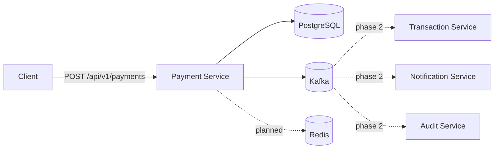

# Event-Driven Payment Platform

A portfolio-grade payment processing backend focused on the engineering concerns that matter in real distributed systems: **idempotent APIs, durable persistence, event-driven workflows, failure isolation, observability, and clear service boundaries**.

> Status: Phase 1 — Payment command service is implemented. Transaction, notification, audit, outbox, retry/DLQ, auth, and deployment modules are planned next.

## Why this project exists

Payment APIs look simple until retries, duplicate requests, partial failures, asynchronous processing, and audit requirements are introduced. This project demonstrates how to design those concerns deliberately instead of hiding them behind a CRUD demo.

## Architecture



## Implemented in Phase 1

- Java 17 + Spring Boot backend
- Versioned REST API
- `Idempotency-Key` support backed by a database uniqueness guarantee
- PostgreSQL persistence with Flyway migrations
- Kafka `payments.created.v1` event publication
- Idempotent Kafka producer configuration
- Request validation and API exception handling
- Spring Boot Actuator health/metrics endpoints
- Unit test covering duplicate-request behavior
- Docker Compose for PostgreSQL, Redis, and Kafka
- GitHub Actions Maven CI

## API

### Create a payment

```bash
curl -X POST http://localhost:8080/api/v1/payments \
  -H 'Content-Type: application/json' \
  -H 'Idempotency-Key: checkout-7f41d' \
  -d '{
    "amount": 42.50,
    "currency": "USD",
    "customerId": "customer-123"
  }'
```

Repeating the request with the same `Idempotency-Key` returns the already-created payment instead of creating a duplicate.

### Retrieve a payment

```bash
curl http://localhost:8080/api/v1/payments/{paymentId}
```

## Run locally

Prerequisites: Java 17+, Maven, Docker.

```bash
docker compose up -d
mvn spring-boot:run -pl payment-service
```

Health endpoint:

```bash
curl http://localhost:8080/actuator/health
```

## Engineering decisions

### Idempotency

Client retries are normal in payment systems. The API accepts an `Idempotency-Key`, persists it with a unique database constraint, and reuses the original payment for repeated requests. A later phase will add Redis as a fast-path while PostgreSQL remains the durability boundary.

### Event-driven processing

The command path persists the payment and publishes a versioned `payments.created.v1` event keyed by payment ID. Downstream transaction, notification, and audit workflows will consume this event independently.

### Failure handling roadmap

Publishing directly after a database write still leaves a dual-write failure window. The next backend milestone replaces this with a **transactional outbox**, followed by retry topics and a dead-letter queue. That evolution is intentional and documented as part of the system-design story.

## Roadmap

- [x] Payment command API
- [x] PostgreSQL + Flyway
- [x] Kafka event publishing
- [x] Base CI pipeline
- [ ] Transactional outbox pattern
- [ ] Transaction service Kafka consumer
- [ ] Notification service
- [ ] Audit service
- [ ] Redis idempotency fast-path
- [ ] Retry topics + dead-letter queue
- [ ] OAuth2/JWT authentication
- [ ] OpenAPI documentation
- [ ] Testcontainers integration tests
- [ ] OpenTelemetry + Prometheus/Grafana
- [ ] Kubernetes manifests / Helm
- [ ] AWS deployment architecture

## Tech stack

**Backend:** Java 17, Spring Boot, Spring Data JPA, Spring Kafka  
**Data:** PostgreSQL, Redis  
**Messaging:** Apache Kafka  
**Infrastructure:** Docker Compose, GitHub Actions  
**Observability:** Spring Boot Actuator (OpenTelemetry/Prometheus planned)

## Repository structure

```text
event-driven-payment-platform/
├── payment-service/
│   ├── src/main/java/com/veda/payments/
│   ├── src/main/resources/db/migration/
│   └── src/test/
├── docs/
├── .github/workflows/ci.yml
├── docker-compose.yml
├── pom.xml
└── README.md
```

## Design principle

This repository is developed incrementally. Each milestone should add one meaningful distributed-systems concern and document the trade-off it solves, so the commit history reflects actual engineering evolution rather than a one-shot code dump.
