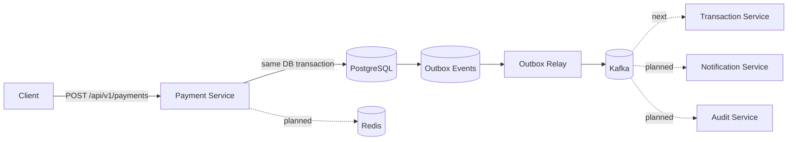

# Event-Driven Payment Platform

A portfolio-grade payment processing backend focused on the engineering concerns that matter in real distributed systems: **idempotent APIs, durable persistence, event-driven workflows, failure isolation, observability, and clear service boundaries**.

> Status: Phase 2 — Payment command service + transactional outbox are implemented. Transaction consumer, retry/DLQ, auth, observability, and deployment modules are next.

## Why this project exists

Payment APIs look simple until retries, duplicate requests, partial failures, asynchronous processing, and audit requirements are introduced. This project demonstrates how to design those concerns deliberately instead of hiding them behind a CRUD demo.

## Architecture



## Implemented

- Java 17 + Spring Boot backend
- Versioned REST API
- `Idempotency-Key` support backed by a database uniqueness guarantee
- PostgreSQL persistence with Flyway migrations
- Transactional outbox table written in the same transaction as the payment
- Scheduled outbox relay publishing `payments.created.v1` events to Kafka
- At-least-once event delivery semantics
- Idempotent Kafka producer configuration
- Request validation and API exception handling
- Spring Boot Actuator health/metrics endpoints
- Unit test covering duplicate-request behavior
- Docker Compose for PostgreSQL, Redis, and Kafka
- GitHub Actions Maven CI

## API

### Create a payment

```bash
curl -X POST http://localhost:8080/api/v1/payments \
  -H 'Content-Type: application/json' \
  -H 'Idempotency-Key: checkout-7f41d' \
  -d '{
    "amount": 42.50,
    "currency": "USD",
    "customerId": "customer-123"
  }'
```

Repeating the request with the same `Idempotency-Key` returns the already-created payment instead of creating a duplicate.

### Retrieve a payment

```bash
curl http://localhost:8080/api/v1/payments/{paymentId}
```

## Run locally

Prerequisites: Java 17+, Maven, Docker.

```bash
docker compose up -d
mvn spring-boot:run -pl payment-service
```

Health endpoint:

```bash
curl http://localhost:8080/actuator/health
```

## Engineering decisions

### Idempotency

Client retries are normal in payment systems. The API accepts an `Idempotency-Key`, persists it with a unique database constraint, and reuses the original payment for repeated requests. A later phase will add Redis as a fast-path while PostgreSQL remains the durability boundary.

### Why a transactional outbox?

A direct `save payment -> publish Kafka` flow creates a dual-write problem: the database commit may succeed while Kafka publication fails. The payment would then exist without the corresponding domain event.

The current flow persists both the payment and its outbox record inside the same database transaction:

```text
HTTP request
   ↓
PaymentService
   ↓
BEGIN TRANSACTION
   ├── INSERT payment
   └── INSERT outbox event
COMMIT
   ↓
OutboxRelay
   ↓
Kafka: payments.created.v1
```

This makes the database the durable boundary. If Kafka is unavailable, the outbox event remains `PENDING` and the relay can attempt publication again.

### Delivery semantics

The relay currently provides **at-least-once delivery**. A process failure can occur after Kafka acknowledges an event but before the outbox row is marked `PUBLISHED`, so the same event can be emitted again. That is expected rather than hidden.

The next transaction-service consumer will therefore use the immutable `eventId` as an idempotency key and persist processed event IDs so duplicate Kafka deliveries do not duplicate business effects.

### Current relay trade-off

The first relay implementation polls small batches from PostgreSQL and publishes them synchronously before marking each event complete. This keeps the failure model easy to inspect. A later scale-oriented iteration can add row claiming / `SKIP LOCKED`, backoff, terminal failure states, and concurrent relay workers.

## Roadmap

- [x] Payment command API
- [x] PostgreSQL + Flyway
- [x] Transactional outbox pattern
- [x] Kafka outbox relay
- [x] Base CI pipeline
- [ ] Idempotent transaction-service Kafka consumer
- [ ] Retry topics + dead-letter queue
- [ ] Notification service
- [ ] Audit service
- [ ] Redis idempotency fast-path
- [ ] OAuth2/JWT authentication
- [ ] OpenAPI documentation
- [ ] Testcontainers integration tests
- [ ] OpenTelemetry + Prometheus/Grafana
- [ ] Multi-instance outbox claiming with `SKIP LOCKED`
- [ ] Kubernetes manifests / Helm
- [ ] AWS deployment architecture

## Tech stack

**Backend:** Java 17, Spring Boot, Spring Data JPA, Spring Kafka  
**Data:** PostgreSQL, Redis  
**Messaging:** Apache Kafka  
**Infrastructure:** Docker Compose, GitHub Actions  
**Observability:** Spring Boot Actuator (OpenTelemetry/Prometheus planned)

## Repository structure

```text
event-driven-payment-platform/
├── payment-service/
│   ├── src/main/java/com/charitha/payments/
│   │   ├── api/
│   │   ├── domain/
│   │   ├── outbox/
│   │   └── service/
│   ├── src/main/resources/db/migration/
│   └── src/test/
├── docs/
├── .github/workflows/ci.yml
├── docker-compose.yml
├── pom.xml
└── README.md
```

## Design principle

This repository is developed incrementally. Each milestone adds one meaningful distributed-systems concern and documents the trade-off it solves, so the commit history reflects actual engineering evolution rather than a one-shot code dump.
