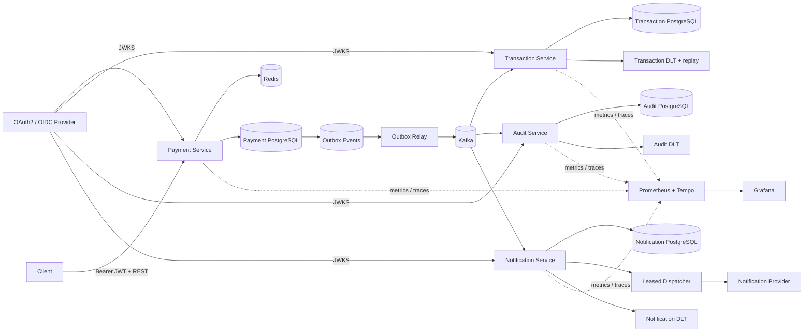

# Event-Driven Payment Platform

A portfolio-grade payment backend built to demonstrate production concerns beyond CRUD: **authenticated APIs, concurrency-safe idempotency, transactional messaging, at-least-once delivery, consumer deduplication, bounded recovery, operational replay, immutable audit evidence, asynchronous provider delivery, observability, container hardening, Kubernetes deployment, and AWS infrastructure as code**.

> Status: **Phase 14** — Payment, Transaction, Audit, and Notification run as independent Spring Boot services with separate datastores. The repository now includes hardened containers, Kubernetes/Helm packaging, a validated AWS Terraform reference architecture, EKS Pod Identity workload roles, managed RDS/MSK/ElastiCache mappings, and an opt-in GitHub OIDC deployment workflow. No AWS infrastructure is created automatically by CI.

## Architecture



### AWS production mapping

```text
GitHub Actions
     |
     | OIDC -> short-lived deploy role
     v
Amazon ECR
     |
     | immutable images
     v
Amazon EKS (private app subnets)
     |
     +--> Payment Service ------> RDS PostgreSQL (payments)
     |       |                   ElastiCache Serverless Redis
     |       `-----------------> MSK Serverless (IAM)
     |
     +--> Transaction Service --> RDS PostgreSQL (transactions)
     |       `-----------------> MSK Serverless (IAM)
     |
     +--> Audit Service --------> RDS PostgreSQL (audit)
     |       `-----------------> MSK Serverless (IAM)
     |
     `--> Notification Service -> RDS PostgreSQL (notifications)
             `-----------------> MSK Serverless (IAM)

Each workload ServiceAccount -> EKS Pod Identity -> dedicated IAM role
```

Terraform owns the AWS reference infrastructure. Helm owns application workloads and runtime configuration. Stateful application dependencies remain managed AWS services rather than being installed inside EKS.

## Engineering highlights

- **Java 17 + Spring Boot 4** multi-service Maven project
- **OAuth2/JWT Resource Servers** with JWKS signature validation, issuer/audience/timing checks, and scope authorization
- Customer-scoped PostgreSQL + Redis idempotency with `Idempotency-Key`
- Concurrency-safe payment creation using PostgreSQL conflict handling
- **Transactional outbox** so payment state and event intent commit atomically
- Multi-instance outbox relay using `FOR UPDATE SKIP LOCKED`, leases, retry backoff, and terminal failure state
- Independent Kafka consumer groups for Transaction, Audit, and Notification
- Transaction consumer idempotency with durable `processed_events`
- Bounded Kafka retries, DLT indexing, and secured operational replay
- Append-only Audit Service records with SHA-256 integrity verification
- Notification ingestion deduplication plus leased asynchronous provider dispatch
- Provider retry/backoff, terminal delivery state, and stable provider idempotency keys
- Runtime-generated **OpenAPI + Swagger UI**
- **Prometheus + Micrometer + OpenTelemetry/OTLP + Grafana + Tempo**
- Testcontainers verification with real PostgreSQL, Redis, and Kafka
- Reusable non-root JVM Docker image with memory-aware JVM settings
- **Helm-managed Kubernetes Deployments, Services, HPAs, PDBs, ConfigMap/Secret boundaries, probes, rolling updates, and optional Ingress**
- **Terraform-managed AWS reference architecture** spanning two AZs with EKS, ECR, four RDS PostgreSQL datastores, MSK Serverless, ElastiCache Serverless Redis, IAM, and CloudWatch control-plane logs
- **EKS Pod Identity** gives each workload a distinct IAM role for MSK instead of static cloud credentials
- **GitHub Actions OIDC** provides short-lived deployment credentials and an immutable ECR -> Helm -> EKS release path
- CI validates observability configuration, Terraform formatting/provider schemas, generic + AWS Helm rendering, the Maven reactor, and all four runtime images

## Core payment flow

```text
Authenticated customer + Idempotency-Key
        |
        v
customer-scoped Redis cache
  |-- HIT --> compare request --> original payment / 409
  `-- MISS / unavailable
             |
             v
PostgreSQL (customer_id, idempotency_key)
  |-- existing --> compare --> return / 409
  `-- absent
       |
       v
INSERT ... ON CONFLICT DO NOTHING
  |-- winner --> payment + outbox in one transaction
  `-- loser  --> load winner and return same result
```

The outbox relay claims rows with `FOR UPDATE SKIP LOCKED`, commits the short claim transaction, then publishes to Kafka. Delivery remains intentionally **at least once**, so downstream services keep durable idempotency boundaries.

## Transaction and DLT recovery

Transaction Service consumes `payments.created.v1`, writes the business transaction and `processed_events` marker atomically, and ignores duplicate event IDs. Retryable failures receive bounded retry; exhausted or malformed records move to the transaction DLT.

The DLT is indexed durably for operations. `ops:read` permits inspection and `ops:write` permits replay. Replay uses a leased `REPLAYING` claim and publishes outside the database transaction. A crash after Kafka acknowledgment can still duplicate a replay, which is safe because transaction processing remains idempotent.

## Immutable Audit Service

Audit Service independently consumes the same payment event stream. Event ID is the logical idempotency key, Kafka source position is independently unique, and PostgreSQL rejects `UPDATE` and `DELETE` on audit records. Detail reads recompute the stored SHA-256 integrity digest.

## Asynchronous Notification Service

Notification Service converts each logical payment event into one durable EMAIL delivery request. A unique `(source_event_id, channel)` constraint makes event replay idempotent.

```text
payments.created.v1
        |
        v
Notification consumer
        |
        v
Notification DB: PENDING
        |
        v
FOR UPDATE SKIP LOCKED claim
        |
        v
Provider call outside DB transaction
   | success             -> SENT
   | retryable failure   -> RETRY_PENDING + backoff
   ` permanent/exhausted -> FAILED
```

Kafka ingestion and external provider delivery are separate failure domains. A `PROCESSING` lease allows another replica to reclaim abandoned work. Because a crash can occur after a provider accepts a message but before `SENT` is persisted, the stable notification ID is forwarded as the provider idempotency key. End-to-end exactly-once provider delivery is deliberately not claimed.

## API and authorization

| Service / operation | Authorization |
| --- | --- |
| Payment `POST /api/v1/payments` | `payments:write` |
| Payment `GET /api/v1/payments/{paymentId}` | `payments:read` + JWT-sub ownership |
| Transaction `GET /api/v1/operations/dlt/**` | `ops:read` |
| Transaction `POST /api/v1/operations/dlt/{eventId}/replay` | `ops:write` |
| Audit `GET /api/v1/audit/payments/{paymentId}` | `audit:read` |
| Audit `GET /api/v1/audit/events/{eventId}` | `audit:read` |
| Notification `GET /api/v1/notifications/{notificationId}` | `notification:read` |
| Notification `GET /api/v1/notifications?paymentId=...` | `notification:read` |
| `/actuator/metrics/**` | `ops:read` |
| `/actuator/prometheus` | `ops:read` by default |
| `/actuator/health`, `/actuator/info` | public health/probe endpoints |
| `/v3/api-docs`, `/swagger-ui.html` | public API documentation where enabled |

Logical JWT audiences are independently configurable: `payment-api`, `transaction-ops-api`, `audit-api`, and `notification-api`.

## Observability

All four services expose Micrometer telemetry and can export traces over OTLP. Domain metrics include payment outbox publication, transaction processing/DLT recovery, audit ingestion, and notification ingestion/delivery attempts.

The local observability profile provisions Prometheus, Grafana, and Tempo. Shared environments should keep `/actuator/prometheus` protected and provide authenticated scraping instead of enabling the local unauthenticated switch.

The AWS values profile points OTLP traffic at an in-cluster ADOT/OpenTelemetry Collector service, but Phase 14 does **not** provision that collector. Install one separately or override the endpoint before enabling real AWS trace export.

## Run locally

Prerequisites: Java 17+, Maven, Docker, and an OAuth2/OIDC provider or test issuer exposing JWKS.

```bash
docker compose up -d

export JWT_ISSUER_URI=https://issuer.example.com/
export JWT_AUDIENCE=payment-api
export TRANSACTION_JWT_AUDIENCE=transaction-ops-api
export AUDIT_JWT_AUDIENCE=audit-api
export NOTIFICATION_JWT_AUDIENCE=notification-api
export JWT_JWK_SET_URI=https://issuer.example.com/.well-known/jwks.json

mvn spring-boot:run -pl payment-service
mvn spring-boot:run -pl transaction-service
mvn spring-boot:run -pl audit-service
mvn spring-boot:run -pl notification-service
```

Service ports are `8080` through `8083`. Local PostgreSQL instances use `5432` through `5435`.

Run the complete test suite:

```bash
mvn --batch-mode verify
```

Start local monitoring with:

```bash
docker compose --profile observability up -d
export OBSERVABILITY_PUBLIC_PROMETHEUS=true
export OTEL_TRACING_ENABLED=true
export OTEL_EXPORTER_OTLP_TRACES_ENDPOINT=http://localhost:4318/v1/traces
```

Grafana is on `localhost:3000`, Prometheus on `localhost:9090`, and Tempo on `localhost:3200`.

## Kubernetes / Helm

The chart is in `deploy/helm/payment-platform`. It deploys application workloads only. Database, Kafka, Redis, OIDC, and OTLP endpoints are injected through values.

```bash
helm lint deploy/helm/payment-platform
helm template payment-platform deploy/helm/payment-platform --namespace payments
```

The chart supports dedicated ServiceAccounts for all four workloads, hardened pod security, HPA/PDB, health probes, graceful rolling updates, and an optional Ingress. See [`docs/kubernetes.md`](docs/kubernetes.md).

## AWS infrastructure and delivery

Terraform is under `deploy/aws/terraform`. Normal CI performs formatting and provider-schema validation **without AWS credentials and without creating resources**.

```bash
terraform -chdir=deploy/aws/terraform fmt -check -diff -recursive
terraform -chdir=deploy/aws/terraform init -backend=false -input=false
terraform -chdir=deploy/aws/terraform validate
```

The AWS reference maps the platform to:

```text
Compute       Amazon EKS + managed node group
Images        Amazon ECR, immutable tags
Messaging     Amazon MSK Serverless + IAM/SASL
Databases     four Amazon RDS for PostgreSQL instances
Cache         ElastiCache Serverless for Redis
Identity      EKS Pod Identity per workload
CI/CD auth    GitHub Actions OIDC -> short-lived AWS role
Logs          EKS control-plane logs -> CloudWatch
```

The deployment workflow `.github/workflows/aws-deploy.yml` is **manual (`workflow_dispatch`) only** and restricted to the `production` GitHub Environment. It builds/pushes commit-tagged ECR images, discovers managed endpoints, materializes RDS-managed credentials from Secrets Manager into the existing Kubernetes Secret contract, and deploys with Helm `--atomic` before checking all four rollouts.

A real AWS apply/deploy requires an AWS account and creates billable resources. This repository does not automatically run `terraform apply` or deploy to AWS on merge. See [`docs/aws.md`](docs/aws.md) for the architecture, prerequisites, identity boundaries, state backend guidance, deployment variables, and operational notes.

## Verification

**Payment Service:** PostgreSQL + Redis tests cover concurrent/customer-scoped idempotency, rollback/cache behavior, outbox claiming, JWT authorization/ownership, OpenAPI, and Prometheus metrics.

**Transaction Service:** Kafka + PostgreSQL tests cover duplicate delivery, DLT indexing, secured replay, repeat-replay safety, and operational scopes.

**Audit Service:** Kafka + PostgreSQL tests verify logical duplicate events produce one record, stored hashes verify successfully, PostgreSQL rejects audit mutation, malformed records reach the audit DLT, audit APIs enforce `audit:read`, and OpenAPI remains public.

**Notification Service:** Kafka + PostgreSQL tests verify logical duplicate events create one delivery, retryable failure persists `RETRY_PENDING` and later reaches `SENT`, permanent failure reaches `FAILED`, malformed records reach the notification DLT, APIs enforce `notification:read`, and OpenAPI remains public.

**Infrastructure:** CI validates the observability profile, Terraform formatting/provider schemas, generic Helm output, the AWS MSK-IAM/Redis-TLS Helm profile, four dedicated ServiceAccounts, the complete Maven reactor, and all four hardened service images.

## Roadmap

- [x] Payment command API + PostgreSQL/Flyway
- [x] Redis idempotency fast path + concurrency-safe customer-scoped idempotency
- [x] Transactional outbox + multi-instance `SKIP LOCKED` relay
- [x] Idempotent Transaction Service + Kafka retries/DLT recovery
- [x] Durable DLT indexing + secured operational replay
- [x] OAuth2/JWT authentication and authorization
- [x] OpenAPI + Swagger UI
- [x] Prometheus + OpenTelemetry + Grafana/Tempo
- [x] Immutable Audit Service + dedicated datastore
- [x] Notification Service + leased retryable provider dispatch
- [x] PostgreSQL / Redis / Kafka Testcontainers verification
- [x] Containerized service runtime + Kubernetes/Helm deployment
- [x] **AWS Terraform reference architecture + OIDC/ECR/EKS delivery pipeline**
- [ ] Expand audit ingestion to transaction/notification lifecycle topics
- [ ] Real provider adapter with secret-managed credentials
- [ ] AWS observability hardening: ADOT/managed Prometheus/alerts
- [ ] Load/performance testing and capacity report

## Tech stack

**Backend:** Java 17, Spring Boot, Spring Data JPA, Spring Data Redis, Spring Kafka  
**API:** REST, OpenAPI, springdoc, Swagger UI  
**Security:** Spring Security, OAuth2 Resource Server, JWT, JWKS, scopes, AWS IAM, EKS Pod Identity, GitHub OIDC  
**Data:** PostgreSQL, Redis, Amazon RDS, ElastiCache Serverless  
**Messaging:** Apache Kafka, Amazon MSK Serverless, AWS MSK IAM auth  
**Observability:** Micrometer, Prometheus, OpenTelemetry, OTLP, Tempo, Grafana, Spring Boot Actuator, CloudWatch control-plane logs  
**Testing:** JUnit, Spring Security Test, Testcontainers  
**Infrastructure:** Docker, Docker Compose, Kubernetes, Helm, Terraform, Amazon EKS, ECR, RDS, MSK, ElastiCache, IAM, Secrets Manager, GitHub Actions

## Repository structure

```text
event-driven-payment-platform/
├── payment-service/
├── transaction-service/
├── audit-service/
├── notification-service/
├── deploy/
│   ├── helm/payment-platform/
│   │   ├── Chart.yaml
│   │   ├── values.yaml
│   │   ├── values-aws.yaml
│   │   └── templates/
│   └── aws/terraform/
│       ├── networking.tf
│       ├── platform.tf
│       ├── iam.tf
│       ├── variables.tf
│       ├── outputs.tf
│       └── versions.tf
├── observability/
├── docs/
│   ├── architecture.md
│   ├── kubernetes.md
│   └── aws.md
├── Dockerfile
├── .dockerignore
├── .github/workflows/
│   ├── ci.yml
│   └── aws-deploy.yml
├── docker-compose.yml
├── pom.xml
└── README.md
```

## Design principle

Each milestone introduces a concrete production concern and documents the trade-off it solves. The repository evolves through reviewable PRs so its history demonstrates service boundaries, failure modes, correctness invariants, deployment boundaries, cloud identity, and executable verification rather than a one-shot code dump.
