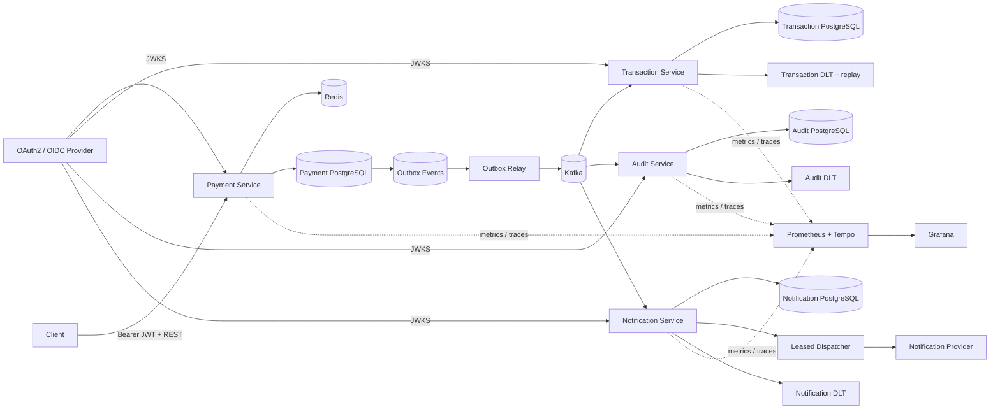

# Event-Driven Payment Platform

A portfolio-grade payment backend built to demonstrate production concerns beyond CRUD: **authenticated APIs, concurrency-safe idempotency, transactional messaging, at-least-once delivery, consumer deduplication, bounded recovery, operational replay, immutable audit evidence, asynchronous provider delivery, observability, container hardening, and Kubernetes deployment**.

> Status: **Phase 13** — Payment, Transaction, Audit, and Notification run as independent Spring Boot services with separate datastores. The platform now includes a reusable hardened JVM image contract and a Helm chart with health probes, rolling updates, autoscaling, disruption budgets, secret/config boundaries, and optional ingress.

## Architecture



### Kubernetes runtime

```text
Ingress (optional)
      |
      +--> payment Service ------> Payment Deployment ------> Payment DB / Redis
      +--> transaction Service --> Transaction Deployment --> Transaction DB
      +--> audit Service --------> Audit Deployment --------> Audit DB
      `--> notification Service -> Notification Deployment -> Notification DB

All application Deployments
      |
      +--> Kafka
      +--> OAuth2/OIDC JWKS
      `--> OTLP collector

Helm owns application compute and runtime configuration.
PostgreSQL, Kafka, Redis, identity, and telemetry backends stay external/replaceable.
```

## Engineering highlights

- **Java 17 + Spring Boot 4** multi-service Maven project
- **OAuth2/JWT Resource Servers** with JWKS signature validation, issuer/audience/timing checks, and scope authorization
- Customer-scoped PostgreSQL + Redis idempotency with `Idempotency-Key`
- Concurrency-safe payment creation using PostgreSQL conflict handling
- **Transactional outbox** so payment state and event intent commit atomically
- Multi-instance outbox relay using `FOR UPDATE SKIP LOCKED`, leases, retry backoff, and terminal failure state
- Independent Kafka consumer groups for Transaction, Audit, and Notification
- Transaction consumer idempotency with durable `processed_events`
- Bounded Kafka retries, DLT indexing, and secured operational replay
- Append-only Audit Service records with SHA-256 integrity verification
- Notification ingestion deduplication plus leased asynchronous provider dispatch
- Provider retry/backoff, terminal delivery state, and stable provider idempotency keys
- Runtime-generated **OpenAPI + Swagger UI**
- **Prometheus + Micrometer + OpenTelemetry/OTLP + Grafana + Tempo**
- Testcontainers verification with real PostgreSQL, Redis, and Kafka
- Reusable non-root JVM Docker image with memory-aware JVM settings
- **Helm-managed Kubernetes Deployments, Services, HPAs, PDBs, ConfigMap/Secret boundaries, probes, rolling updates, and optional Ingress**
- GitHub Actions validates infrastructure configuration, Helm rendering, the Maven reactor, and all four runtime images

## Core payment flow

```text
Authenticated customer + Idempotency-Key
        |
        v
customer-scoped Redis cache
  |-- HIT --> compare request --> original payment / 409
  `-- MISS / unavailable
             |
             v
PostgreSQL (customer_id, idempotency_key)
  |-- existing --> compare --> return / 409
  `-- absent
       |
       v
INSERT ... ON CONFLICT DO NOTHING
  |-- winner --> payment + outbox in one transaction
  `-- loser  --> load winner and return same result
```

The outbox relay claims rows with `FOR UPDATE SKIP LOCKED`, commits the short claim transaction, then publishes to Kafka. Delivery remains intentionally **at least once**, so downstream services keep durable idempotency boundaries.

## Transaction and DLT recovery

Transaction Service consumes `payments.created.v1`, writes the business transaction and `processed_events` marker atomically, and ignores duplicate event IDs. Retryable failures receive bounded retry; exhausted or malformed records move to the transaction DLT.

The DLT is indexed durably for operations. `ops:read` permits inspection and `ops:write` permits replay. Replay uses a leased `REPLAYING` claim and publishes outside the database transaction. A crash after Kafka acknowledgment can still duplicate a replay, which is safe because transaction processing remains idempotent.

## Immutable Audit Service

Audit Service independently consumes the same payment event stream. Event ID is the logical idempotency key, Kafka source position is independently unique, and PostgreSQL rejects `UPDATE` and `DELETE` on audit records. Detail reads recompute the stored SHA-256 integrity digest.

## Asynchronous Notification Service

Notification Service converts each logical payment event into one durable EMAIL delivery request. A unique `(source_event_id, channel)` constraint makes event replay idempotent.

```text
payments.created.v1
        |
        v
Notification consumer
        |
        v
Notification DB: PENDING
        |
        v
FOR UPDATE SKIP LOCKED claim
        |
        v
Provider call outside DB transaction
   | success            -> SENT
   | retryable failure  -> RETRY_PENDING + backoff
   ` permanent/exhausted -> FAILED
```

Kafka ingestion and external provider delivery are separate failure domains. A `PROCESSING` lease allows another replica to reclaim abandoned work. Because a crash can occur after a provider accepts a message but before `SENT` is persisted, the stable notification ID is forwarded as the provider idempotency key. End-to-end exactly-once provider delivery is deliberately not claimed.

## API and authorization

| Service / operation | Authorization |
| --- | --- |
| Payment `POST /api/v1/payments` | `payments:write` |
| Payment `GET /api/v1/payments/{paymentId}` | `payments:read` + JWT-sub ownership |
| Transaction `GET /api/v1/operations/dlt/**` | `ops:read` |
| Transaction `POST /api/v1/operations/dlt/{eventId}/replay` | `ops:write` |
| Audit `GET /api/v1/audit/payments/{paymentId}` | `audit:read` |
| Audit `GET /api/v1/audit/events/{eventId}` | `audit:read` |
| Notification `GET /api/v1/notifications/{notificationId}` | `notification:read` |
| Notification `GET /api/v1/notifications?paymentId=...` | `notification:read` |
| `/actuator/metrics/**` | `ops:read` |
| `/actuator/prometheus` | `ops:read` by default |
| `/actuator/health`, `/actuator/info` | public health/probe endpoints |
| `/v3/api-docs`, `/swagger-ui.html` | public API documentation where enabled |

Logical JWT audiences are independently configurable: `payment-api`, `transaction-ops-api`, `audit-api`, and `notification-api`.

## Observability

All four services expose Micrometer telemetry and can export traces over OTLP. Domain metrics include payment outbox publication, transaction processing/DLT recovery, audit ingestion, and notification ingestion/delivery attempts.

The local observability profile provisions Prometheus, Grafana, and Tempo. Shared environments should keep `/actuator/prometheus` protected and provide authenticated scraping instead of enabling the local unauthenticated switch.

## Run locally

Prerequisites: Java 17+, Maven, Docker, and an OAuth2/OIDC provider or test issuer exposing JWKS.

```bash
docker compose up -d

export JWT_ISSUER_URI=https://issuer.example.com/
export JWT_AUDIENCE=payment-api
export TRANSACTION_JWT_AUDIENCE=transaction-ops-api
export AUDIT_JWT_AUDIENCE=audit-api
export NOTIFICATION_JWT_AUDIENCE=notification-api
export JWT_JWK_SET_URI=https://issuer.example.com/.well-known/jwks.json

mvn spring-boot:run -pl payment-service
mvn spring-boot:run -pl transaction-service
mvn spring-boot:run -pl audit-service
mvn spring-boot:run -pl notification-service
```

Service ports are `8080` through `8083`. Local PostgreSQL instances use `5432` through `5435`.

Run the complete test suite:

```bash
mvn --batch-mode verify
```

Start local monitoring with:

```bash
docker compose --profile observability up -d
export OBSERVABILITY_PUBLIC_PROMETHEUS=true
export OTEL_TRACING_ENABLED=true
export OTEL_EXPORTER_OTLP_TRACES_ENDPOINT=http://localhost:4318/v1/traces
```

Grafana is on `localhost:3000`, Prometheus on `localhost:9090`, and Tempo on `localhost:3200`.

## Build runtime images

Build the Spring Boot jars first:

```bash
mvn --batch-mode -DskipTests package
```

The root `Dockerfile` is intentionally shared by all four services. Each image receives exactly one packaged jar and runs as UID/GID `10001` on the JRE runtime image.

```bash
docker build --build-arg JAR_FILE=payment-service/target/payment-service-0.1.0-SNAPSHOT.jar --build-arg SERVICE_PORT=8080 -t ghcr.io/charithaa07/payment-service:0.13.0 .
```

Use the equivalent service jar/port for Transaction (`8081`), Audit (`8082`), and Notification (`8083`). CI builds all four images from the packaged reactor.

## Deploy with Helm

The chart is in `deploy/helm/payment-platform`. It deploys application workloads only; database, Kafka, Redis, OIDC, and OTLP endpoints are injected through values so they can later map to managed AWS services.

```bash
helm lint deploy/helm/payment-platform
helm template payment-platform deploy/helm/payment-platform --namespace payments
```

Database usernames/passwords are read from the pre-existing `payment-platform-secrets` Kubernetes Secret. No real credentials or secret values are committed to the repository.

A production install should override dependency endpoints and use immutable image tags or digests:

```bash
helm upgrade --install payment-platform deploy/helm/payment-platform \
  --namespace payments \
  --create-namespace \
  --set-string global.kafkaBootstrapServers='kafka.example.internal:9092' \
  --set-string global.redisHost='redis.example.internal' \
  --set-string services.payment.image.tag='0.13.0'
```

See [`docs/kubernetes.md`](docs/kubernetes.md) for the deployment model, secret contract, image commands, external dependency overrides, and scaling notes.

### Kubernetes reliability/security model

- rolling updates use `maxUnavailable: 0` and `maxSurge: 1`
- Spring Boot startup/readiness/liveness probes are enabled explicitly
- graceful shutdown receives a 30-second pod termination window
- HPA uses `autoscaling/v2` with CPU requests as its utilization denominator
- PodDisruptionBudgets retain at least one replica during voluntary disruption
- topology spread reduces unnecessary same-node concentration
- containers run non-root with `allowPrivilegeEscalation: false`, `RuntimeDefault` seccomp, dropped capabilities, and a read-only root filesystem
- `/tmp` is an `emptyDir`, preserving JVM compatibility without making the image filesystem writable
- service-account tokens are not mounted because the applications do not call the Kubernetes API
- non-secret settings live in a ConfigMap; database credentials come from an externally managed Secret

Kubernetes scaling does not change messaging correctness: outbox delivery remains at least once, consumers remain database-idempotent, and Kafka partitions/provider quotas remain independent limits on effective parallelism.

## Verification

**Payment Service:** PostgreSQL + Redis tests cover concurrent/customer-scoped idempotency, rollback/cache behavior, outbox claiming, JWT authorization/ownership, OpenAPI, and Prometheus metrics.

**Transaction Service:** Kafka + PostgreSQL tests cover duplicate delivery, DLT indexing, secured replay, repeat-replay safety, and operational scopes.

**Audit Service:** Kafka + PostgreSQL tests verify logical duplicate events produce one record, stored hashes verify successfully, PostgreSQL rejects audit mutation, malformed records reach the audit DLT, audit APIs enforce `audit:read`, and OpenAPI remains public.

**Notification Service:** Kafka + PostgreSQL tests verify logical duplicate events create one delivery, retryable failure persists `RETRY_PENDING` and later reaches `SENT`, permanent failure reaches `FAILED`, malformed records reach the notification DLT, APIs enforce `notification:read`, and OpenAPI remains public.

**Deployment:** CI runs `helm lint`, renders the chart and asserts four Deployments/Services/HPAs/PDBs, packages the Maven reactor, and builds all four service runtime images.

## Roadmap

- [x] Payment command API + PostgreSQL/Flyway
- [x] Redis idempotency fast path + concurrency-safe customer-scoped idempotency
- [x] Transactional outbox + multi-instance `SKIP LOCKED` relay
- [x] Idempotent Transaction Service + Kafka retries/DLT recovery
- [x] Durable DLT indexing + secured operational replay
- [x] OAuth2/JWT authentication and authorization
- [x] OpenAPI + Swagger UI
- [x] Prometheus + OpenTelemetry + Grafana/Tempo
- [x] Immutable Audit Service + dedicated datastore
- [x] Notification Service + leased retryable provider dispatch
- [x] PostgreSQL / Redis / Kafka Testcontainers verification
- [x] GitHub Actions CI
- [x] **Containerized service runtime + Kubernetes/Helm deployment**
- [ ] Expand audit ingestion to transaction/notification lifecycle topics
- [ ] Real provider adapter with secret-managed credentials
- [ ] **AWS deployment architecture and cloud delivery pipeline**

## Tech stack

**Backend:** Java 17, Spring Boot, Spring Data JPA, Spring Data Redis, Spring Kafka  
**API:** REST, OpenAPI, springdoc, Swagger UI  
**Security:** Spring Security, OAuth2 Resource Server, JWT, JWKS, scopes  
**Data:** PostgreSQL, Redis  
**Messaging:** Apache Kafka  
**Observability:** Micrometer, Prometheus, OpenTelemetry, OTLP, Tempo, Grafana, Spring Boot Actuator  
**Testing:** JUnit, Spring Security Test, Testcontainers  
**Infrastructure:** Docker, Docker Compose, Kubernetes, Helm, HPA, PodDisruptionBudget, ConfigMap/Secret, GitHub Actions

## Repository structure

```text
event-driven-payment-platform/
├── payment-service/
├── transaction-service/
├── audit-service/
├── notification-service/
├── deploy/
│   └── helm/payment-platform/
│       ├── Chart.yaml
│       ├── values.yaml
│       └── templates/
├── observability/
├── docs/
│   ├── architecture.md
│   └── kubernetes.md
├── Dockerfile
├── .dockerignore
├── .github/workflows/ci.yml
├── docker-compose.yml
├── pom.xml
└── README.md
```

## Design principle

Each milestone introduces a concrete production concern and documents the trade-off it solves. The repository evolves through reviewable PRs so its history demonstrates service boundaries, failure modes, correctness invariants, deployment boundaries, and executable verification rather than a one-shot code dump.
