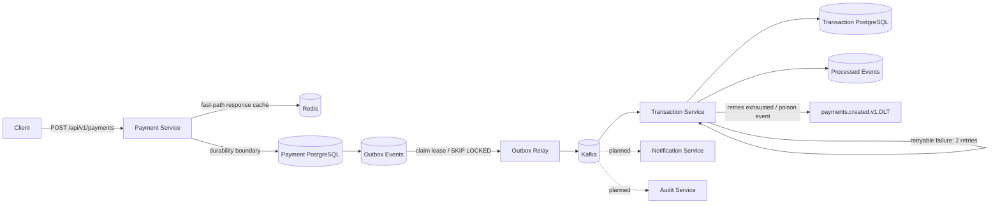

# Event-Driven Payment Platform

A portfolio-grade payment processing backend focused on engineering concerns that matter in distributed systems: **idempotent APIs, durable persistence, event-driven workflows, failure isolation, concurrency safety, and clear service boundaries**.

> Status: Phase 6.1 — concurrency-safe request idempotency, Redis fast-path caching, transactional outbox delivery, an idempotent transaction consumer, bounded Kafka retries/DLT recovery, and container-backed integration testing are implemented. Authentication, API documentation, and observability are next.

## Why this project exists

Payment APIs look simple until retries, simultaneous duplicate requests, partial failures, asynchronous processing, and audit requirements are introduced. This project develops those concerns incrementally instead of hiding them behind a CRUD example.

## Architecture



## Implemented

- Java 17 + Spring Boot services
- Versioned payment REST API
- `Idempotency-Key` validation aligned with database constraints
- Concurrency-safe idempotency using PostgreSQL `ON CONFLICT DO NOTHING`
- `409 Conflict` when an idempotency key is reused with different payment details
- Redis-backed idempotency response cache with configurable TTL
- Redis cache hits bypass the PostgreSQL lookup
- Redis failures degrade to PostgreSQL instead of failing payment creation
- Newly created responses are cached only after the payment/outbox transaction commits
- PostgreSQL persistence with Flyway migrations
- Transactional outbox written in the same transaction as the payment
- Multi-instance outbox claiming with `FOR UPDATE SKIP LOCKED`
- Outbox processing leases so abandoned claims become eligible again
- Bounded outbox retry with backoff, failure diagnostics, and terminal `FAILED` state
- Kafka publication performed outside the short database claim transaction
- At-least-once event delivery semantics
- Separate Transaction Service with its own PostgreSQL datastore
- Durable consumer idempotency using `processed_events`
- Payment-level uniqueness guard against duplicate transaction rows
- Original Kafka delivery + 2 retries with 1-second fixed backoff
- Dead-letter routing to `payments.created.v1.DLT`
- Malformed payloads classified as non-retryable and sent directly to the DLT
- Testcontainers coverage with real PostgreSQL, Kafka, and Redis
- GitHub Actions Maven CI

## Request and reliability flow

```text
HTTP request + Idempotency-Key
        |
        v
Redis response cache
  |-- HIT --> compare request --> return original payment
  |
  `-- MISS / unavailable
             |
             v
       PostgreSQL lookup
         |-- existing --> compare request --> warm Redis --> return
         |
         `-- absent
              |
              v
       INSERT ... ON CONFLICT DO NOTHING
         |-- inserted
         |      |
         |      +--> INSERT outbox event in same transaction
         |      `--> COMMIT --> warm Redis
         |
         `-- conflict --> load winning row
                           |
                           +--> same request --> return winner
                           `--> different request --> 409 Conflict
```

The database remains the correctness boundary. Redis only accelerates repeated requests. Two concurrent requests using the same idempotency key can race safely at PostgreSQL: only one payment row is inserted, only that winner creates an outbox event, and the other request resolves to the winning payment.

## Outbox delivery flow

```text
Payment + outbox transaction commits
        |
        v
PENDING outbox event
        |
        v
short DB transaction
  SELECT claimable batch
  FOR UPDATE SKIP LOCKED
  mark PROCESSING + claimed_at
COMMIT
        |
        v
Kafka publish outside claim transaction
   |-- success --> mark PUBLISHED
   |
   `-- failure --> incremented attempt already recorded at claim
                  schedule next_attempt_at with backoff
                  |
                  `--> max attempts reached --> FAILED
```

A processing lease allows a later relay pass to reclaim a `PROCESSING` event if an instance dies after claiming it. This avoids permanently stranded rows while keeping the platform intentionally at-least-once.

## Consumer flow

```text
Kafka: payments.created.v1
        |
        v
Transaction Service
        |
        v
BEGIN DB TRANSACTION
  +-- check processed_events(event_id)
  +-- INSERT payment_transaction
  `-- INSERT processed_event
COMMIT
        |
        v
listener returns successfully
        |
        v
Kafka offset advances

Retryable failure:
initial attempt -> retry 1 -> retry 2 -> payments.created.v1.DLT

Malformed payload:
initial attempt -> payments.created.v1.DLT
```

If the database commits but the Kafka offset is not advanced, the event may be delivered again. The durable `processed_events` record and transaction uniqueness constraints make that redelivery safe.

## Integration coverage

The integration suite uses Testcontainers so CI exercises real infrastructure rather than replacing all boundaries with mocks.

### Payment request concurrency and atomicity

A PostgreSQL + Redis integration test launches two simultaneous create requests with the same idempotency key. It verifies that both resolve to the same payment and that exactly one payment row and one outbox row exist.

The same suite verifies that:

- reusing the key with different payment data raises an idempotency conflict;
- rolling back a transaction leaves no payment, no outbox event, and no Redis entry;
- a committed payment is persisted and cached;
- the outbox `SKIP LOCKED` claim query executes against real PostgreSQL and finds the committed event.

### Redis fast path

A real Redis container verifies full response serialization, TTL handling, and malformed-value eviction. Unit coverage also forces Redis connection failures to confirm the cache remains fail-open.

### Kafka consumer reliability

A real Apache Kafka container and PostgreSQL container verify that duplicate delivery produces one business transaction and that malformed JSON reaches `payments.created.v1.DLT`.

### Database bootstrap

Fresh PostgreSQL containers start with empty schemas. Flyway migrations run before Hibernate validation, proving both services can bootstrap their datastores from versioned migrations.

## API

### Create a payment

```bash
curl -X POST http://localhost:8080/api/v1/payments \
  -H 'Content-Type: application/json' \
  -H 'Idempotency-Key: checkout-7f41d' \
  -d '{
    "amount": 42.50,
    "currency": "USD",
    "customerId": "customer-123"
  }'
```

Repeating the same request with the same key returns the original payment. Reusing that key with different amount, currency, or customer data returns **409 Conflict**.

### Retrieve a payment

```bash
curl http://localhost:8080/api/v1/payments/{paymentId}
```

## Run locally

Prerequisites: Java 17+, Maven, Docker.

```bash
docker compose up -d
mvn spring-boot:run -pl payment-service
mvn spring-boot:run -pl transaction-service
```

Run the complete unit and container-backed integration suite:

```bash
mvn --batch-mode test
```

Health endpoints:

```bash
curl http://localhost:8080/actuator/health
curl http://localhost:8081/actuator/health
```

## Engineering decisions

### PostgreSQL owns idempotency correctness

A unique `idempotency_key` is still the durable guard, but relying on an exception from that constraint makes concurrent retries awkward. The create path therefore uses PostgreSQL `INSERT ... ON CONFLICT DO NOTHING`. A losing request loads the winning row and validates that the original request data matches before returning it.

This is also why the API does not treat an idempotency key as a generic cache key: using the same key for a different payment is an application conflict, not a cache hit.

### Redis is an optimization, not a dependency for correctness

Redis stores a complete payment response for the duplicate-create fast path. On a cache miss, malformed cache entry, or connection failure, the service falls back to PostgreSQL. New entries are written only after transaction commit, preventing rolled-back payments from becoming visible through Redis.

The cache TTL is configurable through `IDEMPOTENCY_REDIS_TTL_HOURS` and defaults to 24 hours.

### Transactional outbox

A direct `save payment -> publish Kafka` path has a dual-write failure window. The platform instead saves the payment and outbox event in the same PostgreSQL transaction. Kafka availability therefore does not determine whether the business transaction can commit.

The relay claims a small batch with row locks and `SKIP LOCKED`, commits the claim quickly, then performs network I/O. Success marks the row `PUBLISHED`; failure records diagnostics and schedules another attempt. A bounded maximum prevents poison events from retrying forever.

A crash after Kafka acknowledges a send but before the outbox row becomes `PUBLISHED` can still cause redelivery. That is intentional: the system chooses at-least-once delivery and makes the consumer idempotent instead of pretending distributed exactly-once behavior exists across the service boundary.

### Consumer retries and dead-letter recovery

The Transaction Service uses Spring Kafka's `DefaultErrorHandler`. Retryable failures receive two retries after the original delivery. Malformed event payloads are non-retryable. Exhausted or poison records are published to `<original-topic>.DLT`, and DLT publication failures are surfaced.

### Service data ownership

Payment Service and Transaction Service own separate PostgreSQL databases. Neither service reads or mutates the other's tables; Kafka is their integration boundary.

## Roadmap

- [x] Payment command API
- [x] PostgreSQL + Flyway
- [x] Redis idempotency fast path
- [x] Concurrent request idempotency handling
- [x] Request-conflict detection for reused idempotency keys
- [x] Transactional outbox
- [x] Multi-instance outbox claiming with `SKIP LOCKED`
- [x] Outbox leases, retry backoff, and terminal failure state
- [x] Idempotent Transaction Service consumer
- [x] Separate service-owned transaction datastore
- [x] Bounded Kafka retries
- [x] Dead-letter topic recovery
- [x] PostgreSQL/Redis/Kafka Testcontainers integration tests
- [x] Base CI pipeline
- [ ] OAuth2/JWT authentication and authorization
- [ ] OpenAPI documentation
- [ ] OpenTelemetry + Prometheus/Grafana
- [ ] DLT replay / operational recovery endpoint
- [ ] Notification service
- [ ] Audit service
- [ ] Kubernetes manifests / Helm
- [ ] AWS deployment architecture

## Tech stack

**Backend:** Java 17, Spring Boot, Spring Data JPA, Spring Data Redis, Spring Kafka  
**Data:** PostgreSQL, Redis  
**Messaging:** Apache Kafka  
**Testing:** JUnit, Mockito, Testcontainers  
**Infrastructure:** Docker Compose, GitHub Actions  
**Observability:** Spring Boot Actuator (OpenTelemetry/Prometheus planned)

## Repository structure

```text
event-driven-payment-platform/
├── payment-service/
│   ├── src/main/java/com/charitha/payments/
│   │   ├── api/
│   │   ├── domain/
│   │   ├── idempotency/
│   │   ├── messaging/
│   │   ├── outbox/
│   │   └── service/
│   ├── src/main/resources/db/migration/
│   └── src/test/java/com/charitha/payments/
│       ├── api/
│       ├── idempotency/
│       ├── integration/
│       └── service/
├── transaction-service/
│   ├── src/main/java/com/charitha/transactions/
│   ├── src/main/resources/db/migration/
│   └── src/test/java/com/charitha/transactions/
├── docs/
├── .github/workflows/ci.yml
├── docker-compose.yml
├── pom.xml
└── README.md
```

## Design principle

This repository is developed incrementally. Each milestone adds a concrete reliability or systems concern and documents the trade-off it solves, so the history shows actual engineering evolution rather than a one-shot code dump.
