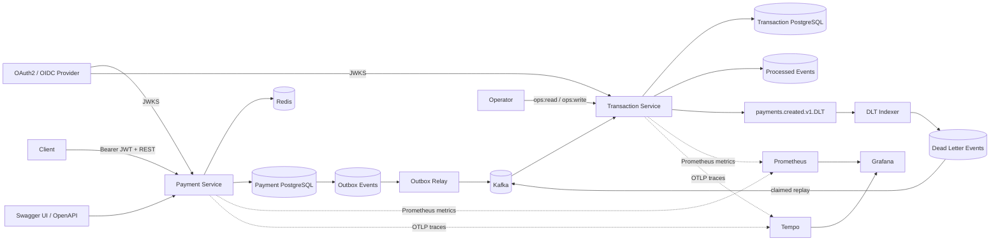

# Event-Driven Payment Platform

A portfolio-grade payment backend built to demonstrate production concerns beyond CRUD: **authenticated APIs, concurrency-safe idempotency, transactional messaging, at-least-once delivery, consumer deduplication, bounded recovery, operational replay, executable API contracts, metrics, and distributed tracing**.

> Status: **Phase 10** — the secured Payment Service and idempotent Transaction Service now include OpenAPI/Swagger, Prometheus metrics, OpenTelemetry/OTLP tracing, Kafka observation, durable dead-letter indexing, a secured DLT inspection/replay workflow, a provisioned Grafana dashboard, and container-backed CI verification.

## Architecture



## Engineering highlights

- **Java 17 + Spring Boot 4** multi-service Maven project
- **OAuth2/JWT Resource Servers** with JWKS signature validation, issuer/audience/timing validation, and scope authorization
- Customer identity derived from JWT `sub`; callers cannot spoof ownership through request JSON
- Customer-scoped `Idempotency-Key` semantics in PostgreSQL and Redis
- Concurrency-safe payment creation using PostgreSQL `ON CONFLICT DO NOTHING`
- `409 Conflict` when the same customer reuses an idempotency key with different payment semantics
- Redis idempotency fast path with PostgreSQL as the durability/source-of-truth fallback
- **Transactional outbox** so payment state and event intent commit atomically
- Multi-instance outbox claiming with `FOR UPDATE SKIP LOCKED`, leases, retry backoff, and terminal failure state
- Kafka publication outside the short claim transaction
- Separate Transaction Service database and durable `processed_events` consumer idempotency
- Original delivery + two Kafka retries, then `payments.created.v1.DLT`
- **Durable DLT index** capturing Kafka position, original record metadata, failure class/message, payload, and replay audit state
- **Secured operational recovery API** with `ops:read` inspection and `ops:write` replay authorization
- Atomic `REPLAYING` claims with stale-claim recovery so concurrent operators cannot replay the same record simultaneously
- Replay publishes outside the DB claim transaction and records operator identity, attempt count, outcome, and errors
- Runtime-generated **OpenAPI contract + Swagger UI** for the Payment Service
- **Prometheus + Micrometer** metrics for HTTP/JVM/Kafka plus domain reliability and DLT-recovery telemetry
- **OpenTelemetry/OTLP** tracing with Kafka observation enabled
- Provisioned **Prometheus + Grafana + Tempo** local observability profile
- Testcontainers integration coverage with real PostgreSQL, Redis, and Kafka
- GitHub Actions CI validates Maven tests, Compose configuration, and Grafana dashboard JSON

## Request and reliability flow

```text
Authenticated customer + Idempotency-Key
        |
        v
customer-scoped Redis cache
  |-- HIT --> compare request --> original payment / 409
  |
  `-- MISS / unavailable
             |
             v
PostgreSQL (customer_id, idempotency_key)
  |-- existing --> compare --> return / 409
  |
  `-- absent
       |
       v
INSERT ... ON CONFLICT DO NOTHING
  |-- winner --> payment + outbox in one transaction
  `-- loser  --> load winner and return same result
```

Redis is an optimization, not the correctness boundary. New cache entries are written after the database transaction commits, and the durable uniqueness constraint remains authoritative during cache misses, outages, and concurrent requests.

## Outbox and consumer flow

```text
payment + PENDING outbox row
        |
        v
FOR UPDATE SKIP LOCKED
mark PROCESSING + lease
COMMIT
        |
        v
Kafka publish
  |-- success --> PUBLISHED
  `-- failure --> bounded backoff --> FAILED after max attempts
        |
        v
payments.created.v1
        |
        v
Transaction Service
  |-- new event --> transaction + processed_events in one DB transaction
  |-- duplicate --> no duplicate business transaction
  `-- failure --> retry 1 --> retry 2 --> payments.created.v1.DLT
```

The messaging guarantee is intentionally **at least once**. A producer-side retry or crash can cause redelivery, so consumer idempotency is part of the design rather than an optional optimization.

## Operational DLT recovery

The DLT is not treated as a permanent message graveyard. A dedicated Transaction Service consumer indexes dead-letter records into its PostgreSQL database for operational inspection and replay.

```text
payments.created.v1.DLT
        |
        v
DLT indexer
  |-- DLT topic / partition / offset
  |-- original topic / partition / offset / consumer group
  |-- message key + payload
  |-- failure class + failure message
  `-- PENDING recovery status
        |
        v
operator inspects with ops:read
        |
        v
POST /api/v1/operations/dlt/{id}/replay  [ops:write]
        |
        v
atomic DB claim: PENDING/FAILED -> REPLAYING
        |
        v
Kafka publish outside DB transaction
  |-- success --> REPLAYED + replayed_at + replayed_by
  `-- failure --> FAILED + last_replay_error
```

The replay claim has a 30-second stale lease. If an instance dies after claiming but before completing the replay, another request can recover the stale claim. Once a record reaches `REPLAYED`, repeating the replay request is idempotent and does not intentionally republish it.

Replay is still **at least once**: a crash after Kafka acknowledges the replay but before PostgreSQL records `REPLAYED` can cause a later replay. The downstream `processed_events` guard makes that duplicate safe.

A deterministic poison payload should only be replayed after the underlying data/code issue is corrected; replaying the same invalid payload will naturally return to the DLT.

## API and security

The Payment Service and Transaction Service validate bearer access tokens issued by an external OAuth2/OIDC provider. Neither service mints credentials.

| Operation | Authorization |
| --- | --- |
| `POST /api/v1/payments` | `payments:write` |
| `GET /api/v1/payments/{paymentId}` | `payments:read` + JWT-sub ownership |
| `GET /api/v1/operations/dlt` | `ops:read` |
| `GET /api/v1/operations/dlt/{eventId}` | `ops:read` |
| `POST /api/v1/operations/dlt/{eventId}/replay` | `ops:write` |
| `/actuator/metrics/**` | `ops:read` |
| `/actuator/prometheus` | `ops:read` by default |
| `/actuator/health`, `/actuator/info` | public probe endpoints |
| Payment Service `/v3/api-docs`, `/swagger-ui.html` | public documentation |

The DLT list endpoint intentionally omits the payload. Operators with `ops:read` can retrieve an individual detail record when payload inspection is necessary. Replay audit metadata records the authenticated operator's JWT `sub`.

### OpenAPI

- Swagger UI: `http://localhost:8080/swagger-ui.html`
- OpenAPI JSON: `http://localhost:8080/v3/api-docs`
- OpenAPI YAML: `http://localhost:8080/v3/api-docs.yaml`

The generated Payment Service contract documents JWT bearer authentication, required scopes, `Idempotency-Key`, schema validation, examples, and `400 / 401 / 403 / 404 / 409` behavior. Integration tests inspect the generated document so controller/security changes cannot silently remove important contract metadata.

## Observability

Both services export Micrometer metrics to Prometheus and can export traces over OTLP to Tempo.

### Domain reliability telemetry

Payment Service exposes:

- `payments.outbox.events{status=pending|processing|failed}` — current outbox backlog
- `payments.outbox.publish.events{outcome=success|failure}` — publish outcomes
- `payments.outbox.publish.latency` — Kafka publication latency

Transaction Service exposes:

- `transactions.payment.events{outcome=received|created|duplicate|malformed}`
- `transactions.payment.processing.latency{outcome=created|duplicate}`
- `transactions.kafka.dlt` — dead-letter publications
- `transactions.kafka.dlt.indexed` — DLT records durably indexed
- `transactions.kafka.dlt.replay{outcome=success|failure}` — operator replay outcomes
- `transactions.kafka.dlt.backlog` — PENDING + FAILED records awaiting recovery

The provisioned Grafana dashboard combines request rate, p95 API latency, JVM heap, outbox backlog, publish failures, transaction outcomes, processing latency, and DLT activity.

### Trace boundary

Kafka observation is enabled on the producer template and listener container. However, the transactional outbox currently persists the **business event payload only**. The original HTTP transaction finishes before the relay later reads that outbox row, so the HTTP request trace and the asynchronous outbox-relay trace are separate unless trace context is explicitly persisted with the outbox event in a future enhancement.

## Run locally

Prerequisites: Java 17+, Maven, Docker, and an OAuth2/OIDC provider (or test issuer) with a JWKS endpoint.

```bash
docker compose up -d

export JWT_ISSUER_URI=https://issuer.example.com/
export JWT_AUDIENCE=payment-api
export TRANSACTION_JWT_AUDIENCE=transaction-ops-api
export JWT_JWK_SET_URI=https://issuer.example.com/.well-known/jwks.json

mvn spring-boot:run -pl payment-service
mvn spring-boot:run -pl transaction-service
```

Run all tests:

```bash
mvn --batch-mode test
```

### Run local observability

```bash
docker compose --profile observability up -d

export OBSERVABILITY_PUBLIC_PROMETHEUS=true
export OTEL_TRACING_ENABLED=true
export OTEL_EXPORTER_OTLP_TRACES_ENDPOINT=http://localhost:4318/v1/traces
export TRACING_SAMPLING_PROBABILITY=1.0
```

Then start both application services. Local tools:

- Grafana: `http://localhost:3000`
- Prometheus: `http://localhost:9090`
- Tempo: `http://localhost:3200`

`OBSERVABILITY_PUBLIC_PROMETHEUS=true` exists only so the local unauthenticated Prometheus container can scrape the application services. **Leave it false in shared/production environments** and use an authenticated or otherwise protected scrape path.

## Verification

The integration suite exercises real infrastructure boundaries rather than only mocks.

**Payment Service:** PostgreSQL + Redis tests cover concurrent idempotency, customer isolation, conflicting retries, transaction rollback/cache behavior, outbox persistence/claiming, HTTP authentication/authorization, ownership, OpenAPI generation, and protected Prometheus metrics.

**Transaction Service:** Kafka + PostgreSQL tests verify duplicate delivery produces one business transaction, malformed events reach and are indexed from the DLT, replayed events re-enter the original topic and create the intended transaction, repeat replay calls remain idempotent after `REPLAYED`, and the operations API enforces `ops:read` / `ops:write` boundaries.

CI additionally validates the Docker Compose observability profile and parses the provisioned Grafana dashboard as JSON before running the full Maven reactor.

## Roadmap

- [x] Payment command API
- [x] PostgreSQL + Flyway
- [x] Redis idempotency fast path
- [x] Concurrent and customer-scoped idempotency
- [x] Transactional outbox
- [x] Multi-instance `SKIP LOCKED` outbox claiming
- [x] Outbox leases, bounded retry/backoff, terminal failure state
- [x] Idempotent Transaction Service consumer
- [x] Kafka retries + dead-letter recovery
- [x] Durable DLT indexing + failure diagnostics
- [x] Secured DLT inspection + operational replay
- [x] PostgreSQL / Redis / Kafka Testcontainers tests
- [x] OAuth2/JWT authentication and authorization
- [x] JWT-derived customer ownership
- [x] OpenAPI contract + Swagger UI
- [x] Prometheus metrics + custom reliability telemetry
- [x] OpenTelemetry/OTLP tracing + Kafka observations
- [x] Provisioned Grafana + Tempo local stack
- [x] GitHub Actions CI
- [ ] Notification service
- [ ] Audit service
- [ ] Kubernetes manifests / Helm
- [ ] AWS deployment architecture

## Tech stack

**Backend:** Java 17, Spring Boot, Spring Data JPA, Spring Data Redis, Spring Kafka  
**API:** REST, OpenAPI, springdoc, Swagger UI  
**Security:** Spring Security, OAuth2 Resource Server, JWT, JWKS, scopes  
**Data:** PostgreSQL, Redis  
**Messaging:** Apache Kafka  
**Observability:** Micrometer, Prometheus, OpenTelemetry, OTLP, Tempo, Grafana, Spring Boot Actuator  
**Testing:** JUnit, Mockito, Spring Security Test, Testcontainers  
**Infrastructure:** Docker Compose, GitHub Actions

## Repository structure

```text
event-driven-payment-platform/
├── payment-service/
├── transaction-service/
│   └── src/main/java/com/charitha/transactions/recovery/
├── observability/
│   ├── prometheus/
│   ├── tempo/
│   └── grafana/
├── docs/
├── .github/workflows/ci.yml
├── docker-compose.yml
├── pom.xml
└── README.md
```

## Design principle

Each milestone introduces a concrete production concern and documents the trade-off it solves. The repository evolves through reviewable PRs so the history demonstrates engineering decisions, failure modes, and verification rather than a one-shot code dump.
