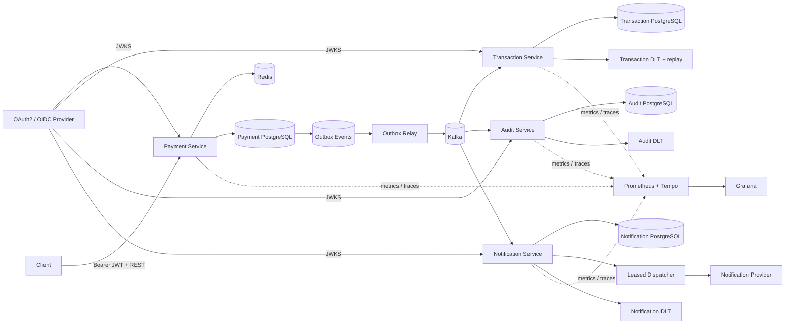

# Event-Driven Payment Platform

A portfolio-grade distributed payment backend built to demonstrate production concerns beyond CRUD: **authenticated APIs, concurrency-safe idempotency, transactional messaging, at-least-once delivery, consumer deduplication, bounded recovery, operational replay, immutable audit evidence, asynchronous provider delivery, observability, performance/resilience testing, Kubernetes deployment, and AWS infrastructure as code**.

> Status: **Phase 15** — four independently owned Spring Boot services are implemented with PostgreSQL/Redis/Kafka correctness boundaries, OAuth2/JWT, OpenAPI, Prometheus/OpenTelemetry, Testcontainers, Helm, validated AWS Terraform, and an executable performance/resilience verification layer. AWS infrastructure is not automatically created by CI, and load-test thresholds are engineering targets rather than pre-claimed production benchmarks.

## Architecture



### AWS production mapping

```text
GitHub Actions --OIDC--> short-lived AWS deploy role
                              |
                              v
                         Amazon ECR
                              |
                              v
                    Amazon EKS / Helm
           +------------------+------------------+
           |                  |                  |
     Payment pod       Transaction pod     Audit / Notification pods
       |      \               |                    |
       |       \              +--------------------+
       |        \                                  |
   RDS payments  ElastiCache Redis            MSK Serverless
       |                                           IAM/SASL
       +--------------------------------------------+

Each workload ServiceAccount -> EKS Pod Identity -> dedicated IAM role
Each service -> separate RDS PostgreSQL datastore
```

Terraform owns the AWS reference infrastructure. Helm owns application workloads and runtime configuration. Stateful dependencies are mapped to managed AWS services rather than installed inside EKS.

## Engineering highlights

- **Java 17 + Spring Boot 4** multi-service Maven project
- **OAuth2/JWT Resource Servers** with JWKS signature, issuer, audience, timing, subject, ownership, and scope checks
- Customer-scoped PostgreSQL + Redis idempotency with `Idempotency-Key`
- Concurrency-safe first-writer handling with PostgreSQL as the final durability boundary
- **Transactional outbox** committing payment state and event intent atomically
- Multi-instance outbox relay using `FOR UPDATE SKIP LOCKED`, leases, bounded retry/backoff, and terminal failure state
- Independent Kafka consumer groups for Transaction, Audit, and Notification
- Durable consumer idempotency, bounded Kafka retries, DLT indexing, and secured replay
- Append-only Audit Service evidence with SHA-256 integrity verification and database-enforced immutability
- Notification ingestion deduplication plus leased provider dispatch with retry/backoff and stable provider idempotency keys
- Runtime-generated **OpenAPI + Swagger UI**
- **Prometheus + Micrometer + OpenTelemetry/OTLP + Tempo + Grafana**
- Real PostgreSQL, Redis, and Kafka **Testcontainers** integration tests
- **k6 performance profiles** for mixed payment traffic and hot-key idempotent retries
- Container-backed eight-way simultaneous first-writer contention verification
- Local Redis failure and Kafka-outage/outbox-recovery drills with safety guards
- Reference SLOs plus validated Prometheus alert rules for API, outbox, DLT, notification, and DB-pool signals
- Hardened non-root JVM runtime image
- **Kubernetes/Helm** Deployments, Services, HPAs, PDBs, probes, rolling updates, ConfigMap/Secret boundaries, and optional Ingress
- **AWS Terraform** for EKS, ECR, four RDS PostgreSQL datastores, MSK Serverless, ElastiCache Serverless Redis, Pod Identity, GitHub OIDC, and CloudWatch control-plane logs
- CI validates performance/observability assets, Terraform provider schemas, generic + AWS Helm rendering, the Maven reactor, and four runtime images

## Core payment correctness

```text
Authenticated customer + Idempotency-Key
        |
        v
customer-scoped Redis cache
  |-- HIT --> compare request --> original payment / 409
  `-- MISS / unavailable
             |
             v
PostgreSQL (customer_id, idempotency_key)
  |-- existing --> compare --> return / 409
  `-- absent
       |
       v
INSERT ... ON CONFLICT DO NOTHING
  |-- winner --> payment + outbox in one transaction
  `-- loser  --> load winner and return same result
```

Redis is deliberately a fail-open optimization; PostgreSQL remains authoritative. New cache entries are written only after the payment transaction commits.

The outbox relay claims rows with `FOR UPDATE SKIP LOCKED`, commits the short claim transaction, and publishes to Kafka outside that transaction. Publication remains **at least once**, so downstream consumers keep durable idempotency boundaries.

## Downstream services

**Transaction Service** consumes `payments.created.v1`, writes the business transaction and `processed_events` marker atomically, ignores duplicate event IDs, applies bounded Kafka retry, durably indexes its DLT, and exposes secured operator replay.

**Audit Service** independently consumes the event stream and preserves immutable integration-boundary evidence with event identity, Kafka source position, original payload, timestamps, and a SHA-256 digest. PostgreSQL rejects audit `UPDATE`/`DELETE` operations.

**Notification Service** creates one durable delivery request per `(source_event_id, channel)`. A leased `FOR UPDATE SKIP LOCKED` dispatcher performs provider calls outside its claim transaction and persists `PENDING -> PROCESSING -> RETRY_PENDING -> SENT/FAILED` state. End-to-end exactly-once provider delivery is not claimed.

## Performance and resilience engineering

Phase 15 adds an executable verification layer rather than a hard-coded throughput claim.

### Mixed load

`performance/k6/payment-api.js` drives a configurable constant arrival rate of unique payment creates, same-key retries, and authenticated reads. It verifies response correctness and exposes threshold targets for request failures and p95/p99 latency.

### Idempotency contention

`performance/k6/idempotency-hot-key.js` repeatedly resolves one seeded customer-scoped key under concurrent load. A separate Testcontainers test launches **eight simultaneous first writers** against real PostgreSQL + Redis and requires all callers to receive one payment ID with exactly one payment row and one outbox row.

### Failure drills

- `performance/resilience/redis-fail-open.sh` stops local Redis and verifies payment creation continues through PostgreSQL fallback.
- `performance/resilience/kafka-outage-outbox-recovery.sh` stops local Kafka, verifies payment requests still commit, confirms outbox backlog accumulation, restarts Kafka, and waits for the relay to drain the backlog.

Both scripts default to local-only safety boundaries. See [`performance/README.md`](performance/README.md) for commands and [`docs/slo.md`](docs/slo.md) for reference SLOs/alert interpretation.

### Measurement discipline

k6 thresholds are **targets**, not benchmark results. A real capacity run must record commit SHA, environment sizing, load shape, latency percentiles, error rate, outbox/Kafka/database signals, replica behavior, and the first saturated dependency. Use [`performance/results/TEMPLATE.md`](performance/results/TEMPLATE.md) for reproducible results.

## API authorization

| Service / operation | Authorization |
| --- | --- |
| Payment `POST /api/v1/payments` | `payments:write` |
| Payment `GET /api/v1/payments/{paymentId}` | `payments:read` + JWT-sub ownership |
| Transaction DLT inspection | `ops:read` |
| Transaction DLT replay | `ops:write` |
| Audit timeline/evidence | `audit:read` |
| Notification delivery queries | `notification:read` |
| `/actuator/metrics/**`, `/actuator/prometheus` | `ops:read` by default |
| `/actuator/health`, `/actuator/info` | public probe endpoints |

Logical JWT audiences are independently configurable for each service.

## Observability and SLO signals

All services expose Micrometer telemetry and optional OpenTelemetry traces over OTLP. The local observability profile provisions Prometheus, Grafana, and Tempo.

Phase 15 adds the `payments_outbox_oldest_age_seconds` freshness gauge and Prometheus rules for sustained Payment API 5xx rate, Payment p95 latency, stale outbox events, terminal outbox rows, Transaction DLT activity, Notification terminal failures, and Hikari connection-pool saturation.

The rules are operational early-warning signals; a short-window alert is not automatically a 30-day SLO violation. Shared environments should keep `/actuator/prometheus` authenticated rather than enabling the local unauthenticated scrape switch.

## Run locally

Prerequisites: Java 17+, Maven, Docker, and an OAuth2/OIDC issuer exposing JWKS.

```bash
docker compose up -d

export JWT_ISSUER_URI=https://issuer.example.com/
export JWT_AUDIENCE=payment-api
export TRANSACTION_JWT_AUDIENCE=transaction-ops-api
export AUDIT_JWT_AUDIENCE=audit-api
export NOTIFICATION_JWT_AUDIENCE=notification-api
export JWT_JWK_SET_URI=https://issuer.example.com/.well-known/jwks.json

mvn spring-boot:run -pl payment-service
mvn spring-boot:run -pl transaction-service
mvn spring-boot:run -pl audit-service
mvn spring-boot:run -pl notification-service
```

Service ports are `8080` through `8083`. Local PostgreSQL instances use `5432` through `5435`.

Run the complete deterministic suite with:

```bash
mvn --batch-mode verify
```

Start monitoring with:

```bash
docker compose --profile observability up -d
export OBSERVABILITY_PUBLIC_PROMETHEUS=true
export OTEL_TRACING_ENABLED=true
export OTEL_EXPORTER_OTLP_TRACES_ENDPOINT=http://localhost:4318/v1/traces
```

Grafana is on `localhost:3000`, Prometheus on `localhost:9090`, and Tempo on `localhost:3200`.

## Kubernetes and AWS delivery

The Helm chart is in `deploy/helm/payment-platform`; the AWS Terraform reference is in `deploy/aws/terraform`.

Normal CI performs Terraform formatting/provider-schema validation and Helm rendering **without AWS credentials and without creating billable resources**. `.github/workflows/aws-deploy.yml` is a manual `workflow_dispatch` path from `main` using a protected `production` GitHub Environment and short-lived OIDC credentials.

The AWS workflow builds commit-tagged ECR images, discovers RDS/MSK/Redis endpoints, materializes RDS-managed credentials from Secrets Manager into the existing Kubernetes Secret contract, performs `helm upgrade --install --atomic`, and checks all four rollouts. A real AWS apply/deploy requires an AWS account and explicit operator action. See [`docs/aws.md`](docs/aws.md) and [`docs/kubernetes.md`](docs/kubernetes.md).

## Verification

**Payment:** real PostgreSQL + Redis tests cover customer-scoped idempotency, concurrent insert races, eight-way contention, rollback/cache behavior, outbox claiming, JWT authorization/ownership, OpenAPI, and metrics.

**Transaction:** real Kafka + PostgreSQL tests cover duplicate delivery, DLT indexing, secured replay, repeat-replay safety, and operator scopes.

**Audit:** real Kafka + PostgreSQL tests cover duplicate events, digest verification, database-enforced immutability, malformed-event DLT routing, secured APIs, and OpenAPI.

**Notification:** real Kafka + PostgreSQL tests cover deduplicated delivery creation, retry scheduling, successful recovery, permanent failure, malformed-event DLT routing, secured APIs, and OpenAPI.

**Performance/observability:** CI runs Prometheus `promtool` validation, k6 script inspection, and shell syntax validation for local failure drills. It intentionally does not benchmark on shared GitHub runners.

**Infrastructure:** CI validates Terraform formatting/provider schemas, generic + AWS Helm output, four dedicated workload identities, the complete Maven reactor, and all four hardened images.

## Roadmap

- [x] Payment API + PostgreSQL/Flyway
- [x] Redis fast-path + concurrency-safe customer-scoped idempotency
- [x] Transactional outbox + multi-instance `SKIP LOCKED` relay
- [x] Idempotent Transaction Service + Kafka retries/DLT recovery
- [x] Durable DLT indexing + secured replay
- [x] OAuth2/JWT + OpenAPI/Swagger
- [x] Prometheus + OpenTelemetry + Grafana/Tempo
- [x] Immutable Audit Service
- [x] Notification Service + leased provider dispatch
- [x] PostgreSQL / Redis / Kafka Testcontainers
- [x] Kubernetes/Helm + hardened containers
- [x] AWS Terraform + OIDC/ECR/EKS delivery path
- [x] **Performance/resilience harness + SLO/alert framework**
- [ ] Measured capacity report from an isolated Kubernetes/AWS test environment
- [ ] Expand audit ingestion to transaction/notification lifecycle topics
- [ ] Real notification provider adapter with secret-managed credentials
- [ ] AWS observability hardening with ADOT/managed telemetry
- [ ] Supply-chain/security scanning and SBOM generation

## Tech stack

**Backend:** Java 17, Spring Boot, Spring Data JPA, Spring Data Redis, Spring Kafka  
**API/Security:** REST, OpenAPI, Swagger UI, Spring Security, OAuth2 Resource Server, JWT, JWKS  
**Data:** PostgreSQL, Redis, Amazon RDS, ElastiCache Serverless  
**Messaging:** Apache Kafka, Amazon MSK Serverless, AWS MSK IAM auth  
**Observability:** Micrometer, Prometheus, OpenTelemetry, OTLP, Tempo, Grafana, CloudWatch  
**Testing:** JUnit, Spring Security Test, Testcontainers, k6, Prometheus promtool  
**Infrastructure:** Docker, Docker Compose, Kubernetes, Helm, Terraform, EKS, ECR, RDS, MSK, ElastiCache, IAM, Secrets Manager, GitHub Actions

## Repository structure

```text
event-driven-payment-platform/
├── payment-service/
├── transaction-service/
├── audit-service/
├── notification-service/
├── performance/
│   ├── k6/
│   ├── resilience/
│   └── results/
├── deploy/
│   ├── helm/payment-platform/
│   └── aws/terraform/
├── observability/
│   ├── prometheus/alerts/
│   ├── grafana/
│   └── tempo/
├── docs/
│   ├── architecture.md
│   ├── kubernetes.md
│   ├── aws.md
│   └── slo.md
├── Dockerfile
├── .github/workflows/
├── docker-compose.yml
├── pom.xml
└── README.md
```

## Design principle

Each milestone introduces a concrete production concern and an executable way to reason about it. The repository deliberately distinguishes **correctness guarantees, engineering targets, validated infrastructure, and measured runtime results** so its history shows real trade-offs rather than a one-shot demo or unsupported production claims.
