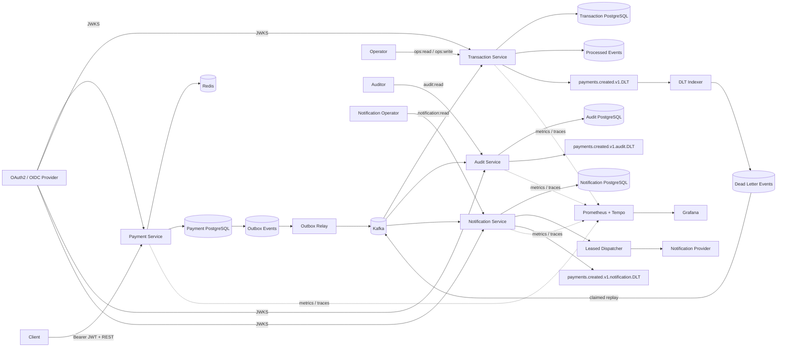

# Event-Driven Payment Platform

A portfolio-grade payment backend built to demonstrate production concerns beyond CRUD: **authenticated APIs, concurrency-safe idempotency, transactional messaging, at-least-once delivery, consumer deduplication, bounded recovery, operational replay, immutable audit evidence, asynchronous provider delivery, executable API contracts, metrics, and distributed tracing**.

> Status: **Phase 12** — Payment, Transaction, Audit, and Notification services run as independent Spring Boot services with separate datastores. The platform includes transactional outbox delivery, idempotent processing, durable DLT recovery, OAuth2/JWT authorization, OpenAPI, Prometheus/OpenTelemetry observability, append-only audit evidence, and leased/retryable asynchronous notification delivery.

## Architecture



## Engineering highlights

- **Java 17 + Spring Boot 4** multi-service Maven project
- **OAuth2/JWT Resource Servers** with JWKS signature validation, issuer/audience/timing validation, and scope authorization
- Customer identity derived from JWT `sub`; payment callers cannot spoof ownership through request JSON
- Customer-scoped `Idempotency-Key` semantics in PostgreSQL and Redis
- Concurrency-safe payment creation using PostgreSQL `ON CONFLICT DO NOTHING`
- Redis idempotency fast path with PostgreSQL as the durability boundary
- **Transactional outbox** so payment state and event intent commit atomically
- Multi-instance outbox claiming with `FOR UPDATE SKIP LOCKED`, leases, retry backoff, and terminal failure state
- Separate Transaction Service datastore with durable `processed_events` idempotency
- Bounded Kafka retries plus durable DLT indexing and secured operational replay
- **Separate Audit Service datastore** consuming `payments.created.v1` independently
- Database-enforced append-only audit records with SHA-256 integrity verification
- **Separate Notification Service datastore** with idempotent event ingestion and durable delivery state
- Provider calls run outside Kafka listener/database claim transactions so slow external delivery does not stall ingestion
- Notification dispatcher uses `FOR UPDATE SKIP LOCKED` plus processing leases for multi-instance claiming and crash recovery
- Retryable provider failures use bounded exponential backoff; permanent failures terminate immediately
- Stable notification IDs are passed as provider idempotency keys so a real provider integration can deduplicate a crash-after-send retry
- Malformed notification-consumer records are isolated to `payments.created.v1.notification.DLT`
- Read-only notification delivery API protected by `notification:read`
- Runtime-generated **OpenAPI + Swagger UI** for externally queryable service APIs
- **Prometheus + Micrometer** metrics and **OpenTelemetry/OTLP** tracing
- Provisioned **Prometheus + Grafana + Tempo** local observability profile
- Testcontainers integration coverage with real PostgreSQL, Redis, and Kafka
- GitHub Actions CI validates infrastructure configuration and the full Maven reactor

## Core payment flow

```text
Authenticated customer + Idempotency-Key
        |
        v
customer-scoped Redis cache
  |-- HIT --> compare request --> original payment / 409
  `-- MISS / unavailable
             |
             v
PostgreSQL (customer_id, idempotency_key)
  |-- existing --> compare --> return / 409
  `-- absent
       |
       v
INSERT ... ON CONFLICT DO NOTHING
  |-- winner --> payment + outbox in one transaction
  `-- loser  --> load winner and return same result
```

The outbox relay claims rows with `FOR UPDATE SKIP LOCKED`, commits the short claim transaction, then publishes to Kafka. Delivery remains intentionally **at least once**, so downstream services must be idempotent.

## Transaction and DLT recovery

Transaction Service consumes `payments.created.v1`, writes the business transaction and `processed_events` marker atomically, and ignores duplicate event IDs. Retryable failures receive two retries; exhausted or malformed records go to `payments.created.v1.DLT`.

The DLT is indexed durably for operations. `ops:read` allows inspection and `ops:write` allows replay. Replay uses an atomic `REPLAYING` claim with a stale-claim lease and publishes outside the database transaction. A crash after Kafka acknowledgment can still produce a duplicate replay, which is safe because the Transaction Service consumer is idempotent.

## Immutable Audit Service

Audit Service consumes the same `payments.created.v1` stream using its own consumer group, so audit ingestion is independent of Transaction Service business processing. `event_id` is the logical idempotency key, Kafka source position is independently unique, and PostgreSQL rejects `UPDATE` and `DELETE` on `audit_events`. Detail reads recompute the stored SHA-256 integrity digest.

## Asynchronous Notification Service

Notification Service consumes `payments.created.v1` with its own consumer group and converts each logical payment event into one durable EMAIL delivery request. The unique `(source_event_id, channel)` constraint makes replayed logical events idempotent.

```text
payments.created.v1
        |
        v
Notification consumer
        |
        | INSERT ... ON CONFLICT DO NOTHING
        v
Notification DB: PENDING
        |
        v
FOR UPDATE SKIP LOCKED claim
        |
        | commit short DB transaction
        v
Provider call outside DB transaction
   | success
   +----------> SENT
   |
   | retryable failure
   +----------> RETRY_PENDING + exponential backoff
   |
   ` permanent / attempts exhausted
              -> FAILED
```

### Delivery correctness boundaries

- Kafka ingestion and external provider delivery are intentionally decoupled. A slow provider cannot hold the Kafka listener open.
- Dispatchers claim work using row locks with `SKIP LOCKED`, then commit before calling the provider. This keeps database lock duration short and allows multiple service instances to share the queue safely.
- A `PROCESSING` lease lets another instance reclaim work after a crashed dispatcher.
- Retryable failures are bounded by `max-attempts` and exponential backoff; permanent provider failures skip pointless retries.
- A crash can occur after the provider accepts a message but before `SENT` is persisted. The same stable notification ID is therefore supplied as an idempotency key to the provider abstraction. End-to-end exactly-once delivery is **not** claimed; a production provider must honor that idempotency key or otherwise tolerate duplicate delivery.
- The built-in `LoggingNotificationProvider` is a development adapter only. It demonstrates the provider boundary without pretending the repository sends real email or SMS.
- Malformed source records move to `payments.created.v1.notification.DLT`. Provider delivery failures remain visible in durable notification state rather than being confused with Kafka ingestion failures.

## API and authorization

| Service / operation | Authorization |
| --- | --- |
| Payment `POST /api/v1/payments` | `payments:write` |
| Payment `GET /api/v1/payments/{paymentId}` | `payments:read` + JWT-sub ownership |
| Transaction `GET /api/v1/operations/dlt/**` | `ops:read` |
| Transaction `POST /api/v1/operations/dlt/{eventId}/replay` | `ops:write` |
| Audit `GET /api/v1/audit/payments/{paymentId}` | `audit:read` |
| Audit `GET /api/v1/audit/events/{eventId}` | `audit:read` |
| Notification `GET /api/v1/notifications/{notificationId}` | `notification:read` |
| Notification `GET /api/v1/notifications?paymentId=...` | `notification:read` |
| `/actuator/metrics/**` | `ops:read` |
| `/actuator/prometheus` | `ops:read` by default |
| `/actuator/health`, `/actuator/info` | public probe endpoints |
| `/v3/api-docs`, `/swagger-ui.html` | public API documentation where enabled |

Logical JWT audiences are independently configurable: `payment-api`, `transaction-ops-api`, `audit-api`, and `notification-api`.

## Observability

All four services expose framework telemetry through Micrometer and can export traces over OTLP. Kafka producer/listener observation remains enabled.

Domain-specific metrics include:

- `payments.outbox.events{status=...}`
- `payments.outbox.publish.events{outcome=...}`
- `payments.outbox.publish.latency`
- `transactions.payment.events{outcome=...}`
- `transactions.kafka.dlt*`
- `audit.payment.events{outcome=received|stored|duplicate|malformed|dead_lettered}`
- `notifications.ingestion.events{outcome=received|stored|duplicate|malformed|dead_lettered}`
- `notifications.delivery.attempts{outcome=sent|retry_scheduled|failed}`

Prometheus is configured to scrape local service ports `8080` through `8083`. The local `OBSERVABILITY_PUBLIC_PROMETHEUS=true` switch exists only for unauthenticated developer scraping; production/shared deployments should keep metrics protected.

### Trace boundary

The transactional outbox currently persists business payload but not the original HTTP W3C trace context. The HTTP request and later scheduled outbox-relay trace are therefore separate traces. Kafka observation can propagate the relay trace to downstream consumers. Provider dispatch runs later from durable notification state, so it is also a separate scheduled trace unless explicit trace context is persisted in a future phase.

## Run locally

Prerequisites: Java 17+, Maven, Docker, and an OAuth2/OIDC provider or test issuer exposing JWKS.

```bash
docker compose up -d

export JWT_ISSUER_URI=https://issuer.example.com/
export JWT_AUDIENCE=payment-api
export TRANSACTION_JWT_AUDIENCE=transaction-ops-api
export AUDIT_JWT_AUDIENCE=audit-api
export NOTIFICATION_JWT_AUDIENCE=notification-api
export JWT_JWK_SET_URI=https://issuer.example.com/.well-known/jwks.json

mvn spring-boot:run -pl payment-service
mvn spring-boot:run -pl transaction-service
mvn spring-boot:run -pl audit-service
mvn spring-boot:run -pl notification-service
```

Service ports:

- Payment Service: `8080`
- Transaction Service: `8081`
- Audit Service: `8082`
- Notification Service: `8083`
- Payment PostgreSQL: `5432`
- Transaction PostgreSQL: `5433`
- Audit PostgreSQL: `5434`
- Notification PostgreSQL: `5435`

Run all unit and container-backed integration tests:

```bash
mvn --batch-mode test
```

Start local monitoring with:

```bash
docker compose --profile observability up -d
export OBSERVABILITY_PUBLIC_PROMETHEUS=true
export OTEL_TRACING_ENABLED=true
export OTEL_EXPORTER_OTLP_TRACES_ENDPOINT=http://localhost:4318/v1/traces
```

Grafana is on `localhost:3000`, Prometheus on `localhost:9090`, and Tempo on `localhost:3200`.

## Verification

**Payment Service:** PostgreSQL + Redis tests cover concurrent/customer-scoped idempotency, rollback/cache behavior, outbox claiming, JWT authorization/ownership, OpenAPI, and Prometheus metrics.

**Transaction Service:** Kafka + PostgreSQL tests cover duplicate delivery, DLT indexing, secured replay, repeat-replay safety, and operational scopes.

**Audit Service:** Kafka + PostgreSQL tests verify logical duplicate events produce one record, stored hashes verify successfully, PostgreSQL rejects audit mutation, malformed records reach the audit DLT, audit query APIs enforce `audit:read`, and OpenAPI remains public.

**Notification Service:** Kafka + PostgreSQL tests verify logical duplicate events create one delivery, retryable provider failure persists `RETRY_PENDING` and later reaches `SENT`, permanent provider failure reaches `FAILED` after one attempt, malformed records reach the notification DLT, delivery APIs enforce `notification:read`, and OpenAPI remains public.

## Roadmap

- [x] Payment command API
- [x] PostgreSQL + Flyway
- [x] Redis idempotency fast path
- [x] Concurrent and customer-scoped idempotency
- [x] Transactional outbox
- [x] Multi-instance `SKIP LOCKED` outbox claiming
- [x] Idempotent Transaction Service consumer
- [x] Kafka retries + dead-letter recovery
- [x] Durable DLT indexing + secured operational replay
- [x] OAuth2/JWT authentication and authorization
- [x] OpenAPI + Swagger UI
- [x] Prometheus + OpenTelemetry + Grafana/Tempo
- [x] Immutable Audit Service + dedicated PostgreSQL datastore
- [x] Audit event idempotency + SHA-256 integrity verification
- [x] Database-enforced append-only audit records
- [x] **Notification Service + dedicated PostgreSQL datastore**
- [x] Idempotent notification ingestion + leased multi-instance dispatch
- [x] Bounded provider retry/backoff + terminal delivery state
- [x] Notification-specific Kafka DLT isolation
- [x] PostgreSQL / Redis / Kafka Testcontainers verification
- [x] GitHub Actions CI
- [ ] Expand audit ingestion to transaction/notification lifecycle topics
- [ ] Real provider adapter with secret-managed credentials
- [ ] Kubernetes manifests / Helm
- [ ] AWS deployment architecture

## Tech stack

**Backend:** Java 17, Spring Boot, Spring Data JPA, Spring Data Redis, Spring Kafka  
**API:** REST, OpenAPI, springdoc, Swagger UI  
**Security:** Spring Security, OAuth2 Resource Server, JWT, JWKS, scopes  
**Data:** PostgreSQL, Redis  
**Messaging:** Apache Kafka  
**Observability:** Micrometer, Prometheus, OpenTelemetry, OTLP, Tempo, Grafana, Spring Boot Actuator  
**Testing:** JUnit, Spring Security Test, Testcontainers  
**Infrastructure:** Docker Compose, GitHub Actions

## Repository structure

```text
event-driven-payment-platform/
├── payment-service/
├── transaction-service/
├── audit-service/
├── notification-service/
│   └── src/main/java/com/charitha/notifications/
│       ├── api/
│       ├── config/
│       ├── delivery/
│       ├── domain/
│       ├── messaging/
│       ├── observability/
│       └── service/
├── observability/
├── docs/
├── .github/workflows/ci.yml
├── docker-compose.yml
├── pom.xml
└── README.md
```

## Design principle

Each milestone introduces a concrete production concern and documents the trade-off it solves. The repository evolves through reviewable PRs so its history demonstrates service boundaries, failure modes, correctness invariants, and executable verification rather than a one-shot code dump.
