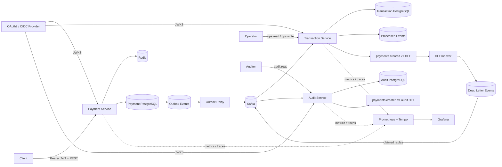

# Event-Driven Payment Platform

A portfolio-grade payment backend built to demonstrate production concerns beyond CRUD: **authenticated APIs, concurrency-safe idempotency, transactional messaging, at-least-once delivery, consumer deduplication, bounded recovery, operational replay, immutable audit evidence, executable API contracts, metrics, and distributed tracing**.

> Status: **Phase 11** — Payment, Transaction, and Audit services now run as independent Spring Boot services with separate datastores. The platform includes transactional outbox delivery, idempotent processing, durable DLT recovery, OAuth2/JWT authorization, OpenAPI, Prometheus/OpenTelemetry observability, and an append-only audit trail for payment-created events.

## Architecture



## Engineering highlights

- **Java 17 + Spring Boot 4** multi-service Maven project
- **OAuth2/JWT Resource Servers** with JWKS signature validation, issuer/audience/timing validation, and scope authorization
- Customer identity derived from JWT `sub`; payment callers cannot spoof ownership through request JSON
- Customer-scoped `Idempotency-Key` semantics in PostgreSQL and Redis
- Concurrency-safe payment creation using PostgreSQL `ON CONFLICT DO NOTHING`
- Redis idempotency fast path with PostgreSQL as the durability boundary
- **Transactional outbox** so payment state and event intent commit atomically
- Multi-instance outbox claiming with `FOR UPDATE SKIP LOCKED`, leases, retry backoff, and terminal failure state
- Separate Transaction Service datastore with durable `processed_events` idempotency
- Bounded Kafka retries plus durable DLT indexing and secured operational replay
- **Separate Audit Service datastore** consuming `payments.created.v1` independently
- Audit records deduplicated by immutable event ID and Kafka source position
- **Database-enforced append-only audit table**: PostgreSQL rejects UPDATE and DELETE operations
- SHA-256 integrity digest over immutable event metadata + original payload, verified on detail reads
- Read-only audit timeline/detail API protected by `audit:read`
- Malformed audit-consumer records isolated to `payments.created.v1.audit.DLT`
- Runtime-generated **OpenAPI + Swagger UI** for externally queryable service APIs
- **Prometheus + Micrometer** metrics and **OpenTelemetry/OTLP** tracing
- Provisioned **Prometheus + Grafana + Tempo** local observability profile
- Testcontainers integration coverage with real PostgreSQL, Redis, and Kafka
- GitHub Actions CI validates infrastructure configuration and the full Maven reactor

## Core payment flow

```text
Authenticated customer + Idempotency-Key
        |
        v
customer-scoped Redis cache
  |-- HIT --> compare request --> original payment / 409
  `-- MISS / unavailable
             |
             v
PostgreSQL (customer_id, idempotency_key)
  |-- existing --> compare --> return / 409
  `-- absent
       |
       v
INSERT ... ON CONFLICT DO NOTHING
  |-- winner --> payment + outbox in one transaction
  `-- loser  --> load winner and return same result
```

The outbox relay claims rows with `FOR UPDATE SKIP LOCKED`, commits the short claim transaction, then publishes to Kafka. Delivery remains intentionally **at least once**, so downstream services must be idempotent.

## Transaction and DLT recovery

Transaction Service consumes `payments.created.v1`, writes the business transaction and `processed_events` marker atomically, and ignores duplicate event IDs. Retryable failures receive two retries; exhausted or malformed records go to `payments.created.v1.DLT`.

The DLT is indexed durably for operations. `ops:read` allows inspection and `ops:write` allows replay. Replay uses an atomic `REPLAYING` claim with a stale-claim lease and publishes outside the database transaction. A crash after Kafka acknowledgment can still produce a duplicate replay, which is safe because the Transaction Service consumer is idempotent.

## Immutable Audit Service

Audit Service consumes the same `payments.created.v1` stream using its own consumer group, so audit ingestion is independent of Transaction Service business processing.

```text
payments.created.v1
        |
        +------------------------------+
        |                              |
        v                              v
Transaction Service              Audit Service
business state                   append-only evidence
        |                              |
        v                              v
Transaction DB                    Audit DB
                               event_id PK
                               Kafka topic/partition/offset
                               aggregate/customer identity
                               original JSON payload
                               SHA-256 record digest
                               occurred_at / recorded_at
```

### Audit correctness boundaries

- `event_id` is the logical idempotency key; replaying the same business event does not create a second audit row.
- `(source_topic, source_partition, source_offset)` is also unique, protecting against repeated delivery of the same Kafka record.
- `record_sha256` covers event ID, event type, payment aggregate ID, customer ID, Kafka source position, and the original payload.
- A PostgreSQL trigger rejects `UPDATE` and `DELETE` against `audit_events`, making append-only behavior a database invariant rather than a controller convention.
- Timeline responses omit the raw payload; event-detail responses include it and report `integrityValid` after recomputing the digest.
- Invalid audit payloads do not poison the primary consumer indefinitely; they are sent to `payments.created.v1.audit.DLT`.

This phase intentionally audits **payment-created events**. Additional lifecycle topics can be added later without coupling Audit Service to another service's database.

## API and authorization

| Service / operation | Authorization |
| --- | --- |
| Payment `POST /api/v1/payments` | `payments:write` |
| Payment `GET /api/v1/payments/{paymentId}` | `payments:read` + JWT-sub ownership |
| Transaction `GET /api/v1/operations/dlt/**` | `ops:read` |
| Transaction `POST /api/v1/operations/dlt/{eventId}/replay` | `ops:write` |
| Audit `GET /api/v1/audit/payments/{paymentId}` | `audit:read` |
| Audit `GET /api/v1/audit/events/{eventId}` | `audit:read` |
| `/actuator/metrics/**` | `ops:read` |
| `/actuator/prometheus` | `ops:read` by default |
| `/actuator/health`, `/actuator/info` | public probe endpoints |
| `/v3/api-docs`, `/swagger-ui.html` | public API documentation where enabled |

Audit Service uses a logical JWT audience of `audit-api`, configurable with `AUDIT_JWT_AUDIENCE`. Transaction operational APIs use their own configured audience; Payment Service defaults to `payment-api`.

## Observability

All three services expose framework telemetry through Micrometer and can export traces over OTLP. Kafka producer/listener observation remains enabled.

Domain-specific metrics include:

- `payments.outbox.events{status=...}`
- `payments.outbox.publish.events{outcome=...}`
- `payments.outbox.publish.latency`
- `transactions.payment.events{outcome=...}`
- `transactions.kafka.dlt*`
- `audit.payment.events{outcome=received|stored|duplicate|malformed|dead_lettered}`

Prometheus is configured to scrape local service ports `8080`, `8081`, and `8082`. The local `OBSERVABILITY_PUBLIC_PROMETHEUS=true` switch exists only for unauthenticated developer scraping; production/shared deployments should keep metrics protected.

### Trace boundary

The transactional outbox currently persists business payload but not the original HTTP W3C trace context. The HTTP request and later scheduled outbox-relay trace are therefore separate traces. Kafka observation can propagate the relay trace to downstream consumers, but the repository does not claim false HTTP-to-consumer continuity.

## Run locally

Prerequisites: Java 17+, Maven, Docker, and an OAuth2/OIDC provider or test issuer exposing JWKS.

```bash
docker compose up -d

export JWT_ISSUER_URI=https://issuer.example.com/
export JWT_AUDIENCE=payment-api
export TRANSACTION_JWT_AUDIENCE=transaction-ops-api
export AUDIT_JWT_AUDIENCE=audit-api
export JWT_JWK_SET_URI=https://issuer.example.com/.well-known/jwks.json

mvn spring-boot:run -pl payment-service
mvn spring-boot:run -pl transaction-service
mvn spring-boot:run -pl audit-service
```

Service ports:

- Payment Service: `8080`
- Transaction Service: `8081`
- Audit Service: `8082`
- Payment PostgreSQL: `5432`
- Transaction PostgreSQL: `5433`
- Audit PostgreSQL: `5434`

Run all unit and container-backed integration tests:

```bash
mvn --batch-mode test
```

Start local monitoring with:

```bash
docker compose --profile observability up -d
export OBSERVABILITY_PUBLIC_PROMETHEUS=true
export OTEL_TRACING_ENABLED=true
export OTEL_EXPORTER_OTLP_TRACES_ENDPOINT=http://localhost:4318/v1/traces
```

Grafana is on `localhost:3000`, Prometheus on `localhost:9090`, and Tempo on `localhost:3200`.

## Verification

**Payment Service:** PostgreSQL + Redis tests cover concurrent/customer-scoped idempotency, rollback/cache behavior, outbox claiming, JWT authorization/ownership, OpenAPI, and Prometheus metrics.

**Transaction Service:** Kafka + PostgreSQL tests cover duplicate delivery, DLT indexing, secured replay, repeat-replay safety, and operational scopes.

**Audit Service:** Kafka + PostgreSQL tests verify logical duplicate events produce one record, stored hashes verify successfully, PostgreSQL rejects audit mutation, malformed records reach the audit DLT, audit query APIs enforce `audit:read`, timeline responses do not expose payloads, detail reads verify integrity, and OpenAPI remains public.

## Roadmap

- [x] Payment command API
- [x] PostgreSQL + Flyway
- [x] Redis idempotency fast path
- [x] Concurrent and customer-scoped idempotency
- [x] Transactional outbox
- [x] Multi-instance `SKIP LOCKED` outbox claiming
- [x] Idempotent Transaction Service consumer
- [x] Kafka retries + dead-letter recovery
- [x] Durable DLT indexing + secured operational replay
- [x] OAuth2/JWT authentication and authorization
- [x] OpenAPI + Swagger UI
- [x] Prometheus + OpenTelemetry + Grafana/Tempo
- [x] **Immutable Audit Service + dedicated PostgreSQL datastore**
- [x] Audit event idempotency + SHA-256 integrity verification
- [x] Database-enforced append-only audit records
- [x] PostgreSQL / Redis / Kafka Testcontainers verification
- [x] GitHub Actions CI
- [ ] Notification service
- [ ] Expand audit ingestion to additional lifecycle topics
- [ ] Kubernetes manifests / Helm
- [ ] AWS deployment architecture

## Tech stack

**Backend:** Java 17, Spring Boot, Spring Data JPA, Spring Data Redis, Spring Kafka  
**API:** REST, OpenAPI, springdoc, Swagger UI  
**Security:** Spring Security, OAuth2 Resource Server, JWT, JWKS, scopes  
**Data:** PostgreSQL, Redis  
**Messaging:** Apache Kafka  
**Observability:** Micrometer, Prometheus, OpenTelemetry, OTLP, Tempo, Grafana, Spring Boot Actuator  
**Testing:** JUnit, Mockito, Spring Security Test, Testcontainers  
**Infrastructure:** Docker Compose, GitHub Actions

## Repository structure

```text
event-driven-payment-platform/
├── payment-service/
├── transaction-service/
├── audit-service/
│   └── src/main/java/com/charitha/audit/
│       ├── api/
│       ├── config/
│       ├── domain/
│       ├── messaging/
│       ├── observability/
│       └── service/
├── observability/
├── docs/
├── .github/workflows/ci.yml
├── docker-compose.yml
├── pom.xml
└── README.md
```

## Design principle

Each milestone introduces a concrete production concern and documents the trade-off it solves. The repository evolves through reviewable PRs so its history demonstrates service boundaries, failure modes, correctness invariants, and executable verification rather than a one-shot code dump.
