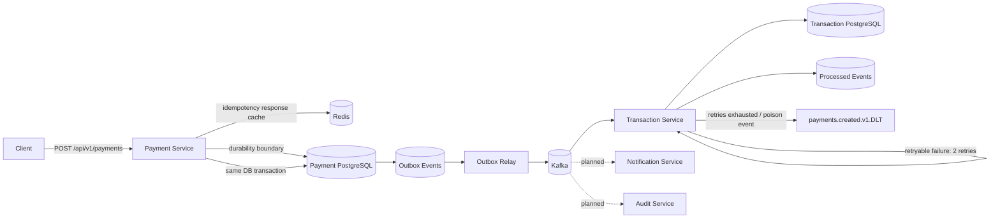

# Event-Driven Payment Platform

A portfolio-grade payment processing backend focused on the engineering concerns that matter in real distributed systems: **idempotent APIs, durable persistence, event-driven workflows, failure isolation, observability, and clear service boundaries**.

> Status: Phase 6 — Payment command service, Redis-backed request idempotency, transactional outbox, idempotent transaction consumer, bounded Kafka retries, dead-letter recovery, and container-backed integration testing are implemented. Auth, observability, and deployment are next.

## Why this project exists

Payment APIs look simple until retries, duplicate requests, partial failures, asynchronous processing, and audit requirements are introduced. This project demonstrates how to design those concerns deliberately instead of hiding them behind a CRUD demo.

## Architecture



## Implemented

- Java 17 + Spring Boot services
- Versioned payment REST API
- `Idempotency-Key` support backed by a PostgreSQL uniqueness guarantee
- Redis-backed idempotency response cache with configurable TTL
- Redis cache hits bypass the PostgreSQL idempotency lookup
- Redis failures degrade to PostgreSQL instead of failing payment creation
- Newly created payment responses are cached only after the database transaction commits
- Malformed Redis cache entries are evicted and treated as cache misses
- PostgreSQL persistence with Flyway migrations
- Transactional outbox written in the same database transaction as the payment
- Scheduled outbox relay publishing `payments.created.v1` events to Kafka
- At-least-once event delivery semantics
- Separate Transaction Service with its own PostgreSQL datastore
- Idempotent Kafka consumer using durable `processed_events` records
- Record-level Kafka acknowledgement after successful local processing
- Payment-level uniqueness guard to prevent duplicate transaction rows
- Bounded consumer retries: 2 retries with 1-second backoff after the initial attempt
- Dead-letter routing to `payments.created.v1.DLT` after retries are exhausted
- Malformed event payloads classified as non-retryable and sent directly to the DLT
- Dead-letter publish failures surfaced instead of silently discarding records
- Testcontainers integration tests with real PostgreSQL, Kafka, and Redis containers
- Integration coverage proving duplicate Kafka delivery creates one business transaction
- Integration coverage proving malformed payloads are published to the DLT
- Integration coverage proving Redis stores and restores complete idempotent payment responses with TTL
- Flyway migrations exercised against an ephemeral PostgreSQL database in CI
- Spring Boot Actuator health/metrics endpoints
- Unit tests covering Redis fast-path/fallback behavior, API idempotency, and duplicate event consumption
- Docker Compose for both PostgreSQL datastores, Redis, and Kafka
- GitHub Actions Maven CI

## Request and reliability flow

```text
HTTP payment request + Idempotency-Key
        ↓
Payment Service
        ↓
Redis idempotency lookup
  ├── HIT  → return cached payment response
  └── MISS / Redis unavailable
              ↓
      PostgreSQL lookup by Idempotency-Key
        ├── existing payment → return it and warm Redis
        └── new request
                  ↓
          BEGIN DB TRANSACTION
            ├── INSERT payment
            └── INSERT outbox event
          COMMIT
                  ↓
          cache payment response in Redis
                  ↓
              return response

Outbox Relay
        ↓
Kafka: payments.created.v1
        ↓
Transaction Service
        ↓
BEGIN DB TRANSACTION
  ├── check processed_events(event_id)
  ├── INSERT payment_transaction
  └── INSERT processed_event
COMMIT
        ↓
listener returns successfully
        ↓
Kafka offset advances

On retryable consumer failure:
initial attempt → retry 1 → retry 2 → payments.created.v1.DLT

On malformed payload:
initial attempt → payments.created.v1.DLT
```

This design intentionally supports **at-least-once delivery**. If the consumer commits its database transaction but fails before the Kafka offset advances, the event can be delivered again. The `processed_events` table makes that redelivery safe.

Redis is deliberately an optimization rather than the correctness boundary. If Redis is unavailable or contains an invalid cached value, the Payment Service falls back to PostgreSQL, where the unique `idempotency_key` constraint remains authoritative.

## Integration coverage

The integration suite uses Testcontainers to exercise production-like infrastructure during the Maven test lifecycle rather than replacing every external boundary with mocks.

### Redis request-idempotency cache

A real Redis container verifies that a complete payment response is serialized, stored with a TTL, and reconstructed correctly. A malformed cached payload is also injected directly into Redis to verify that the service treats it as a miss and evicts the bad value.

The unit suite additionally verifies that Redis connection failures are fail-open: payment processing can continue through the PostgreSQL durability path instead of turning a cache outage into an API outage.

### Duplicate-delivery safety

The Kafka/PostgreSQL integration test publishes the same `payments.created.v1` event twice and verifies that the Transaction Service persists exactly one `payment_transaction` and one `processed_events` record. This validates the consumer idempotency boundary against a real database and broker.

### Dead-letter recovery

The test publishes malformed JSON to `payments.created.v1` and consumes from `payments.created.v1.DLT`, proving that the configured non-retryable failure path reaches the dead-letter topic with the original key and payload.

### Schema migration

The PostgreSQL container starts empty on every CI run. Flyway creates the transaction schema before Hibernate validation, which verifies that the migration scripts can bootstrap a fresh datastore.

## API

### Create a payment

```bash
curl -X POST http://localhost:8080/api/v1/payments \
  -H 'Content-Type: application/json' \
  -H 'Idempotency-Key: checkout-7f41d' \
  -d '{
    "amount": 42.50,
    "currency": "USD",
    "customerId": "customer-123"
  }'
```

Repeating the request with the same `Idempotency-Key` returns the already-created payment instead of intentionally creating another one. Once the response is cached, the duplicate-request path can be served from Redis without performing the PostgreSQL idempotency lookup.

### Retrieve a payment

```bash
curl http://localhost:8080/api/v1/payments/{paymentId}
```

## Run locally

Prerequisites: Java 17+, Maven, Docker.

```bash
docker compose up -d
mvn spring-boot:run -pl payment-service
mvn spring-boot:run -pl transaction-service
```

Run all unit and container-backed integration tests:

```bash
mvn --batch-mode test
```

Payment Service health:

```bash
curl http://localhost:8080/actuator/health
```

Transaction Service health:

```bash
curl http://localhost:8081/actuator/health
```

## Engineering decisions

### Redis-backed request idempotency

Client retries are normal in payment systems, but sending every retry through PostgreSQL creates avoidable read pressure. The Payment Service therefore keeps the durable `Idempotency-Key` mapping in PostgreSQL and uses Redis as a short-lived response cache.

The Redis value contains the payment response needed to satisfy a duplicate create request. A cache hit can return that response immediately. A cache miss falls back to PostgreSQL and warms Redis from the durable payment record.

The cache is intentionally **fail-open**. Redis connection errors are logged and treated as cache misses because Redis is not the correctness boundary. PostgreSQL remains authoritative through the unique `idempotency_key` constraint.

A newly created payment is not written to Redis until its surrounding database transaction has committed. This prevents Redis from advertising a payment that later rolls back because the payment or outbox write failed.

Cached responses use a configurable TTL (`IDEMPOTENCY_REDIS_TTL_HOURS`, default 24 hours). Invalid cached values are evicted rather than propagated into the API response path.

### Transactional outbox

A direct `save payment -> publish Kafka` flow creates a dual-write problem: the database commit may succeed while Kafka publication fails. The payment would then exist without the corresponding domain event.

The current flow persists both the payment and its outbox record inside the same database transaction. If Kafka is unavailable, the outbox event stays `PENDING` and the relay can publish it later.

### Idempotent consumer

The Transaction Service stores processed Kafka event IDs in its own PostgreSQL database. The transaction row and the processed-event marker are committed together.

With record-level acknowledgements, the Kafka offset advances after the listener returns successfully. Since `TransactionProcessor.process()` is transactional, that return happens after its local database transaction has completed. A redelivery can still occur around process failure boundaries, so the durable `processed_events` check remains necessary.

The service also enforces uniqueness on `payment_id` and `source_event_id`, providing a second database-level guard against duplicate writes.

### Bounded retries and dead-letter recovery

Not every consumer failure should be treated the same way. Temporary infrastructure or database failures may succeed on another attempt, while malformed payloads will fail identically every time.

The Transaction Service uses Spring Kafka's `DefaultErrorHandler` with a fixed 1-second backoff and two retries after the original delivery. If processing still fails, a `DeadLetterPublishingRecoverer` sends the original record to `payments.created.v1.DLT` with Kafka's dead-letter metadata headers.

Malformed payloads throw `IllegalArgumentException` and are classified as non-retryable, so they are routed to the DLT immediately rather than wasting retry capacity. DLT publishing is configured to surface send failures rather than silently treating the record as recovered.

### Integration tests use production-like infrastructure

Unit tests remain useful for fast business-logic feedback, but they cannot prove broker wiring, database migrations, Redis TTL behavior, listener acknowledgement behavior, or DLT publishing. The Testcontainers suite therefore exercises Redis, Kafka, and PostgreSQL boundaries in CI.

### Service data ownership

Payment and transaction records live in separate PostgreSQL databases. This keeps the services from reading or mutating each other's tables directly and makes Kafka the integration boundary between them.

### Current relay trade-off

The outbox relay polls small batches from PostgreSQL and publishes them synchronously before marking each event complete. This keeps the failure model easy to inspect. A later scale-oriented iteration can add row claiming / `SKIP LOCKED`, backoff, terminal failure states, and concurrent relay workers.

## Roadmap

- [x] Payment command API
- [x] PostgreSQL + Flyway
- [x] Redis idempotency fast-path
- [x] Transactional outbox pattern
- [x] Kafka outbox relay
- [x] Idempotent Transaction Service Kafka consumer
- [x] Separate service-owned transaction datastore
- [x] Bounded Kafka retries
- [x] Dead-letter topic recovery
- [x] Testcontainers Redis integration tests
- [x] Testcontainers PostgreSQL + Kafka integration tests
- [x] Base CI pipeline
- [ ] Notification service
- [ ] Audit service
- [ ] OAuth2/JWT authentication
- [ ] OpenAPI documentation
- [ ] OpenTelemetry + Prometheus/Grafana
- [ ] DLT replay / operational recovery endpoint
- [ ] Multi-instance outbox claiming with `SKIP LOCKED`
- [ ] Kubernetes manifests / Helm
- [ ] AWS deployment architecture

## Tech stack

**Backend:** Java 17, Spring Boot, Spring Data JPA, Spring Data Redis, Spring Kafka  
**Data:** PostgreSQL, Redis  
**Messaging:** Apache Kafka  
**Testing:** JUnit, Mockito, Testcontainers  
**Infrastructure:** Docker Compose, GitHub Actions  
**Observability:** Spring Boot Actuator (OpenTelemetry/Prometheus planned)

## Repository structure

```text
event-driven-payment-platform/
├── payment-service/
│   ├── src/main/java/com/charitha/payments/
│   │   ├── api/
│   │   ├── config/
│   │   ├── domain/
│   │   ├── idempotency/
│   │   ├── messaging/
│   │   ├── outbox/
│   │   └── service/
│   ├── src/main/resources/db/migration/
│   └── src/test/java/com/charitha/payments/
│       ├── idempotency/
│       └── service/
├── transaction-service/
│   ├── src/main/java/com/charitha/transactions/
│   │   ├── config/
│   │   ├── domain/
│   │   ├── idempotency/
│   │   ├── messaging/
│   │   └── service/
│   ├── src/main/resources/db/migration/
│   └── src/test/java/com/charitha/transactions/
│       ├── integration/
│       └── service/
├── docs/
├── .github/workflows/ci.yml
├── docker-compose.yml
├── pom.xml
└── README.md
```

## Design principle

This repository is developed incrementally. Each milestone adds one meaningful distributed-systems concern and documents the trade-off it solves, so the commit history reflects actual engineering evolution rather than a one-shot code dump.
