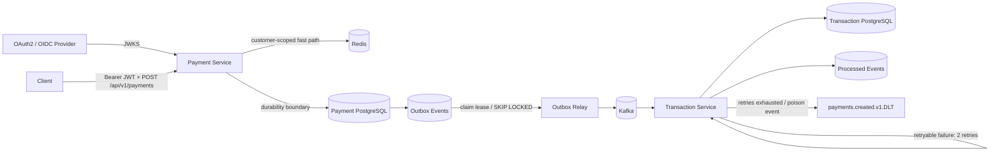

# Event-Driven Payment Platform

A portfolio-grade payment processing backend focused on engineering concerns that matter in distributed systems: **authenticated APIs, idempotency, durable persistence, event-driven workflows, failure isolation, concurrency safety, and clear service boundaries**.

> Status: **Phase 7** — OAuth2/JWT resource-server security, customer-scoped idempotency, concurrency-safe payment creation, Redis fast-path caching, transactional outbox delivery, idempotent Kafka consumption, bounded retries/DLT recovery, and container-backed integration testing are implemented. OpenAPI and deeper observability are next.

## Why this project exists

Payment APIs look simple until retries, simultaneous duplicate requests, identity boundaries, partial failures, asynchronous processing, and audit requirements are introduced. This project develops those concerns incrementally instead of hiding them behind a CRUD example.

## Architecture



## Implemented

- Java 17 + Spring Boot services
- Stateless Spring Security OAuth2 Resource Server
- Bearer JWT signature verification from a configured JWKS endpoint
- JWT issuer, audience, timestamp, and subject validation
- `payments:write` scope required for payment creation
- `payments:read` scope required for payment retrieval
- `ops:read` scope required for metrics/Prometheus endpoints
- Public health/info endpoints for infrastructure probes
- Customer identity derived from JWT `sub`, never trusted from request JSON
- Payment reads scoped to the authenticated customer
- Customer-scoped `Idempotency-Key` semantics in PostgreSQL and Redis
- Concurrency-safe idempotency using PostgreSQL `ON CONFLICT DO NOTHING`
- `409 Conflict` when the same customer reuses a key with different payment details
- Redis-backed idempotency response cache with configurable TTL and fail-open PostgreSQL fallback
- Transactional outbox written in the same transaction as the payment
- Multi-instance outbox claiming with `FOR UPDATE SKIP LOCKED`
- Processing leases, bounded relay backoff, diagnostics, and terminal `FAILED` state
- Kafka publication outside the short database claim transaction
- Separate Transaction Service datastore and durable consumer idempotency
- Bounded Kafka consumer retries and `payments.created.v1.DLT`
- Testcontainers coverage with real PostgreSQL, Redis, and Kafka
- GitHub Actions Maven CI

## Authentication and authorization flow

```text
Bearer access token
        |
        v
JWT signature verification via configured JWKS
        |
        +--> issuer validation
        +--> audience validation
        +--> expiry / timing validation
        `--> non-empty subject validation
                 |
                 v
        scope authorization
          |-- POST /payments --> payments:write
          |-- GET /payments/* --> payments:read
          `-- actuator metrics --> ops:read
                 |
                 v
       JWT sub becomes customer identity
                 |
                 v
 customer-scoped payment / idempotency path
```

The API intentionally does **not** accept a trusted `customerId` in the create-payment request. The authenticated JWT subject is the ownership boundary. A caller cannot create or retrieve a payment as another customer by changing JSON or URL parameters.

A payment owned by another subject is returned as `404 Not Found` rather than exposing whether another customer's resource exists.

## Request and reliability flow

```text
Authenticated customer + Idempotency-Key
        |
        v
customer-scoped Redis response cache
  |-- HIT --> compare amount/currency --> return original payment
  |
  `-- MISS / unavailable
             |
             v
  PostgreSQL lookup by (customer_id, idempotency_key)
         |-- existing --> compare request --> warm Redis --> return / 409
         |
         `-- absent
              |
              v
       INSERT ... ON CONFLICT DO NOTHING
         |-- inserted --> INSERT outbox in same transaction --> COMMIT --> cache response
         `-- conflict --> load same customer's winner --> compare --> return / 409
```

The same textual idempotency key can safely be used by two different authenticated customers. PostgreSQL enforces uniqueness on `(customer_id, idempotency_key)`, and Redis uses a SHA-256-derived customer/key namespace so cache entries cannot collide across customers.

## Outbox delivery flow

```text
Payment + outbox transaction commits
        |
        v
PENDING outbox event
        |
        v
short DB transaction
  SELECT claimable batch
  FOR UPDATE SKIP LOCKED
  mark PROCESSING + claimed_at
COMMIT
        |
        v
Kafka publish outside claim transaction
   |-- success --> PUBLISHED
   `-- failure --> bounded backoff --> retry / FAILED
```

The system intentionally provides **at-least-once** event delivery. A crash after Kafka acknowledges a send but before the outbox row is marked `PUBLISHED` can cause redelivery, so the Transaction Service uses durable `processed_events` idempotency and database uniqueness guards.

## API

The Payment Service expects an access token issued by the configured OAuth2/OIDC provider. Production deployments must set the real issuer, audience, and JWKS endpoint.

Expected claims include:

```json
{
  "iss": "<JWT_ISSUER_URI>",
  "sub": "customer-123",
  "aud": ["payment-api"],
  "scope": "payments:read payments:write",
  "exp": 1789069000
}
```

### Create a payment

Requires `payments:write`.

```bash
curl -X POST http://localhost:8080/api/v1/payments \
  -H "Authorization: Bearer $ACCESS_TOKEN" \
  -H 'Content-Type: application/json' \
  -H 'Idempotency-Key: checkout-7f41d' \
  -d '{
    "amount": 42.50,
    "currency": "USD"
  }'
```

Repeating the same request for the same authenticated customer and key returns the original payment. Reusing that key with a different amount or currency returns **409 Conflict**.

### Retrieve a payment

Requires `payments:read` and ownership by the JWT subject.

```bash
curl http://localhost:8080/api/v1/payments/{paymentId} \
  -H "Authorization: Bearer $ACCESS_TOKEN"
```

### Operational endpoints

`/actuator/health` and `/actuator/info` are public for probes. Metrics require `ops:read`:

```bash
curl http://localhost:8080/actuator/metrics \
  -H "Authorization: Bearer $OPS_ACCESS_TOKEN"
```

## Security configuration

The Payment Service is a **resource server**, not an authorization server. It validates access tokens issued elsewhere and does not mint credentials.

Configure the provider with:

```bash
export JWT_ISSUER_URI=https://issuer.example.com/
export JWT_AUDIENCE=payment-api
export JWT_JWK_SET_URI=https://issuer.example.com/.well-known/jwks.json
```

The defaults in `application.yml` are development placeholders. A real deployment should always provide the values from the chosen OAuth2/OIDC provider.

## Integration coverage

The Maven suite exercises real infrastructure boundaries through Testcontainers and the Spring Security filter chain.

### Payment Service

A PostgreSQL + Redis suite verifies:

- simultaneous same-customer/same-key requests create one payment and one outbox event;
- the same idempotency key can be used independently by different customers;
- same-key/different-body requests are rejected for a customer;
- rolled-back payment/outbox work never populates Redis;
- committed responses are cached;
- the native `SKIP LOCKED` outbox claim query executes against real PostgreSQL;
- unauthenticated payment creation returns `401`;
- insufficient scopes return `403`;
- customer identity comes from JWT `sub` even when a spoofed `customerId` appears in JSON;
- payment retrieval enforces authenticated ownership;
- health remains public while metrics require `ops:read`.

### Transaction Service

A real Kafka + PostgreSQL suite verifies duplicate delivery produces one business transaction and malformed JSON reaches `payments.created.v1.DLT`.

## Run locally

Prerequisites: Java 17+, Maven, Docker, and an OAuth2/OIDC provider (or test issuer) that exposes a JWKS endpoint.

```bash
docker compose up -d
export JWT_ISSUER_URI=https://issuer.example.com/
export JWT_AUDIENCE=payment-api
export JWT_JWK_SET_URI=https://issuer.example.com/.well-known/jwks.json
mvn spring-boot:run -pl payment-service
mvn spring-boot:run -pl transaction-service
```

Run the full unit and container-backed integration suite:

```bash
mvn --batch-mode test
```

## Engineering decisions

### Authenticated identity is the ownership boundary

Accepting `customerId` from the request body would let a caller claim another customer's identity. The Payment Service instead derives ownership from the verified JWT `sub` claim. Repository lookups include that customer identity, so authorization is enforced at the data-access boundary as well as the HTTP route.

### Idempotency is scoped by customer

A globally unique idempotency key creates unnecessary cross-customer collisions. The durable constraint is therefore `(customer_id, idempotency_key)`. Redis mirrors that scope with a hashed compound key. PostgreSQL remains authoritative if Redis is empty, malformed, or unavailable.

### JWT validation is explicit

The resource server verifies token signatures using the configured JWKS and rejects tokens that fail issuer, audience, timing, or subject validation. Authorization then maps OAuth scopes to Spring Security authorities such as `SCOPE_payments:write`.

### Transactional outbox and idempotent consumption

Payment creation and outbox insertion commit atomically. The relay claims work with `SKIP LOCKED`, releases database locks before Kafka I/O, and retries failures with bounded backoff. Because publication is at-least-once, the Transaction Service commits the business transaction and durable processed-event marker together.

## Roadmap

- [x] Payment command API
- [x] PostgreSQL + Flyway
- [x] Redis idempotency fast path
- [x] Concurrent request idempotency handling
- [x] Customer-scoped idempotency
- [x] Transactional outbox
- [x] Multi-instance outbox claiming with `SKIP LOCKED`
- [x] Outbox leases, retry backoff, and terminal failure state
- [x] Idempotent Transaction Service consumer
- [x] Bounded Kafka retries + dead-letter recovery
- [x] PostgreSQL/Redis/Kafka Testcontainers integration tests
- [x] OAuth2/JWT authentication and scope authorization
- [x] JWT-derived customer ownership
- [x] Base CI pipeline
- [ ] OpenAPI documentation
- [ ] OpenTelemetry + Prometheus/Grafana dashboards
- [ ] DLT replay / operational recovery endpoint
- [ ] Notification service
- [ ] Audit service
- [ ] Kubernetes manifests / Helm
- [ ] AWS deployment architecture

## Tech stack

**Backend:** Java 17, Spring Boot, Spring Security, OAuth2 Resource Server, Spring Data JPA, Spring Data Redis, Spring Kafka  
**Data:** PostgreSQL, Redis  
**Messaging:** Apache Kafka  
**Security:** OAuth2, JWT, JWKS, scope-based authorization  
**Testing:** JUnit, Mockito, Spring Security Test, Testcontainers  
**Infrastructure:** Docker Compose, GitHub Actions  
**Observability:** Spring Boot Actuator (OpenTelemetry/Prometheus dashboards planned)

## Repository structure

```text
event-driven-payment-platform/
├── payment-service/
│   ├── src/main/java/com/charitha/payments/
│   │   ├── api/
│   │   ├── config/
│   │   ├── domain/
│   │   ├── idempotency/
│   │   ├── messaging/
│   │   ├── outbox/
│   │   └── service/
│   ├── src/main/resources/db/migration/
│   └── src/test/java/com/charitha/payments/
├── transaction-service/
├── docs/
├── .github/workflows/ci.yml
├── docker-compose.yml
├── pom.xml
└── README.md
```

## Design principle

Each milestone adds a concrete production concern and documents the trade-off it solves. The repository is intentionally evolved in reviewable increments so its history shows engineering decisions rather than a one-shot code dump.
